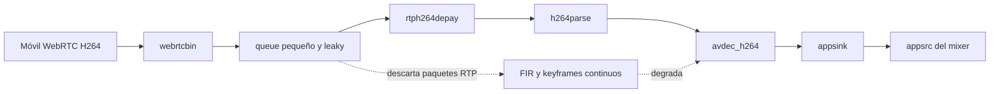

# ADR-0001 — Pixelación WebRTC H.264 causada por pérdida RTP interna

Estado: aceptada
Fecha: 2026-04-20

## Contexto

Durante la integración de la cámara móvil WebRTC en el mixer aparecía una degradación visual progresiva cuando había movimiento.

Los síntomas observados eran estos:

- La imagen empezaba bien y se degradaba al cabo de un rato.
- Con movimiento aparecían macro-bloques, artefactos y pequeños saltos.
- La conexión WebRTC seguía negociando H.264 High.
- La ruta ICE era host->host dentro de la misma LAN.
- El bitrate real podía subir y estabilizarse cerca del techo configurado.
- El bridge appsink→appsrc no reportaba corrupción explícita ni errores de push.

Durante la depuración se probaron varias hipótesis que resultaron incompletas o falsas:

- No era un problema principal de ancho de banda en la WiFi local.
- No era un problema principal de ICE o TURN.
- No era un problema principal de negociar VP8 en lugar de H.264.
- No era un problema principal de falta de bitrate en el emisor.
- No era un problema principal del bridge hacia el mixer ni del renderer por IPC.

La señal que permitió aislar el problema fue la instrumentación de estadísticas WebRTC del emisor:

- `pli=0`
- `nack=0`
- `fir` creciendo de forma continua en cada intervalo
- `keyframes` creciendo al mismo ritmo que `fir`

Ese patrón indicaba que el receptor estaba forzando keyframes de manera sostenida, aunque la red pareciera sana.

## Causa raíz

La causa real estaba en la rama H.264 del receptor GStreamer, antes de `rtph264depay`.

La tubería tenía esta cola:

```text
webrtcbin pad → queue(max-size-buffers=4, leaky=downstream) → rtph264depay → h264parse → avdec_h264
```

El error conceptual fue asumir que esa cola almacenaba frames completos. En ese punto todavía se están almacenando paquetes RTP individuales.

Con H.264 a varios Mbps, un único frame puede ocupar decenas de paquetes RTP. Por tanto:

- `max-size-buffers=4` daba un margen extremadamente pequeño.
- `leaky=downstream` hacía que el propio receptor descartara paquetes comprimidos.
- `rtph264depay` detectaba esas pérdidas como discontinuidades reales.
- El receptor terminaba pidiendo recuperación continua mediante FIR.
- El emisor generaba keyframes adicionales, pero la imagen seguía degradándose con movimiento.

En otras palabras: la pixelación no la estaba provocando la LAN, la estábamos fabricando dentro del receptor.

## Diagrama



## Decisión

Se adopta esta corrección en la rama H.264 explícita:

- Sustituir la cola previa a `rtph264depay` por una cola no leaky.
- Dimensionarla para ráfagas de paquetes RTP, no para frames completos.
- Mantener el descarte agresivo solo después de decodificar, donde ya trabajamos con frames crudos y no con paquetes comprimidos.

La configuración adoptada es:

```text
queue(max-size-buffers=512, max-size-time=250ms, leaky=no)
```

Y se mantiene el resto de la rama así:

- `rtph264depay request-keyframe=true`
- `rtph264depay wait-for-keyframe=false`
- `h264parse config-interval=-1`
- `h264parse disable-passthrough=true`
- `appsink drop=true max-buffers=1`
- `appsrc` del mixer con política live y cola corta
- renderer con `latest-frame-wins`

## Resultado

Tras el cambio:

- desapareció la pixelación incluso con movimiento constante
- la imagen volvió a ser fluida
- `fir` dejó de crecer continuamente
- `pli` y `nack` siguieron en cero
- los keyframes volvieron a un patrón normal

## Consecuencias técnicas

- La causa raíz real queda cerrada y no debe volver a atacarse bajando fps o bitrate “a ciegas”.
- Las estrategias de descarte siguen siendo válidas en `appsink`, `appsrc` y renderer, porque allí ya se descartan frames completos y no paquetes RTP comprimidos.
- La decodificación software explícita con `avdec_h264` se mantiene como baseline estable mientras se planifica una comparativa multicámara.

## Configuración base tras resolver el problema

La configuración base recomendada para el modo local queda así:

- captura móvil a `640x360`
- `30 fps`
- `maxBitrate=5 Mbps`
- `degradationPreference=maintain-resolution`
- rama H.264 explícita con `avdec_h264`

## Trabajo siguiente

El siguiente paso ya no es seguir endureciendo workarounds, sino medir capacidad real del sistema con 2 o 3 cámaras simultáneas.

Las comprobaciones prioritarias son estas:

- uso de CPU del proceso Electron/Main con 1, 2 y 3 cámaras
- estabilidad del mixer y del preview a `30 fps`
- latencia adicional introducida por cada cámara extra
- comportamiento del decode software frente a una posible vuelta controlada a VideoToolbox solo si los benchmarks lo justifican

## Regla práctica que deja este incidente

En una rama WebRTC H.264 de GStreamer:

- antes del depayload se manejan paquetes RTP, no frames
- una cola pequeña y leaky en ese punto puede fabricar pérdida interna muy difícil de diagnosticar
- si hace falta absorber jitter o ráfagas, debe hacerse con margen suficiente para paquetes RTP
- el descarte agresivo es mucho más seguro después de la decodificación