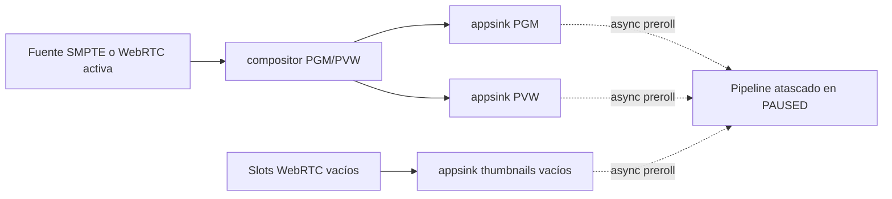

# ADR-0002 — Mixer negro por bloqueo de preroll en appsink

Estado: aceptada
Fecha: 2026-04-20

## Contexto

Tras refactorizar el mixer para reservar tres slots WebRTC dedicados, la interfaz pasó a quedarse negra al conectar la cámara móvil.

Los síntomas eran engañosos:

- La señalización WebRTC completaba offer, answer e ICE correctamente.
- El bridge nativo recibía y empujaba vídeo hacia la fuente WebRTC del mixer a ~30 fps.
- No aparecían errores explícitos en la UI.
- Sin embargo, Program, Preview y thumbnails no recibían ni un solo frame.

Para aislar el problema se ejecutó el addon nativo directamente desde Node.js, sin Electron ni Renderer.

Ese test mostró esto:

- `createMixerPipeline()` y `startPipeline()` no fallaban.
- El pipeline no llegaba a `PLAYING`.
- Quedaba estable en `current=PAUSED` con `pending=PLAYING`.
- Los callbacks de PGM, PVW y thumbnails seguían en cero.
- El bus solo reportaba `NULL -> READY -> PAUSED`.

Eso demostraba que el fallo no estaba en WebRTC ni en el canvas del Renderer, sino en la transición de estado del propio pipeline del mixer.

## Causa raíz

El mixer tiene varias ramas de salida con `appsink`:

- Program
- Preview
- thumbnail de cada fuente

Después del refactor, varias de esas ramas quedaron conectadas a slots WebRTC vacíos mediante `appsrc` live que todavía no habían entregado ningún buffer.

El error fue dejar esos `appsink` con su comportamiento por defecto (`async=true`).

En esa configuración, GStreamer intenta hacer preroll asíncrono de cada sink durante la transición a `PAUSED/PLAYING`.
Como algunas ramas no tenían todavía ningún buffer inicial, esos sinks retenían la transición global del pipeline.

El resultado práctico era este:

- el pipeline no completaba `PAUSED -> PLAYING`
- el compositor no empezaba a emitir salida útil
- la UI quedaba negra aunque no hubiera errores de negociación WebRTC

## Diagrama

## Decisión

Se marca como `async=false` a los `appsink` del mixer que solo se usan para preview:

- `pgm_sink`
- `pvw_sink`
- `thumb0`
- `thumb1`
- `thumb2`
- `thumb3`

Además, se dejó el bus del pipeline con `gst_bus_set_sync_handler(...)` en lugar de `gst_bus_add_watch(...)`, porque en este entorno no hay un `GLib MainLoop` dedicado y así los mensajes de diagnóstico no se pierden.

## Resultado

Tras el cambio:

- el mixer pasa correctamente a `PLAYING`
- los callbacks nativos de PGM y PVW empiezan a producir frames
- los thumbnails vuelven a emitirse
- la interfaz deja de quedarse negra por arranque incompleto del pipeline

En la prueba aislada del addon se observó una recuperación clara:

- estado tras start: `current=PLAYING`, `pending=VOID_PENDING`
- frames en ~4 s: PGM=121, PVW=121, THUMB=29

## Consecuencias técnicas

- En pipelines live con ramas opcionales o dinámicas, un sink de preview no debe bloquear la transición global esperando preroll.
- `sync=false` no sustituye a `async=false`: una propiedad afecta al reloj de reproducción y la otra al preroll del cambio de estado.
- El hecho de que WebRTC negocie bien no implica que el mixer esté realmente arrancado.

## Regla práctica

Si un mixer GStreamer con fuentes live y ramas opcionales se queda en `PAUSED` sin errores aparentes:

- comprobar el estado real del pipeline, no solo la señalización
- revisar qué sinks están esperando preroll
- para previews y thumbnails, considerar `appsink async=false`