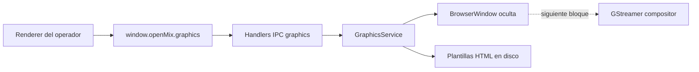

# ADR-0004 — Fase 4 arranca con motor de grafismo preview-first y BrowserWindow oculta

Estado: aceptada
Fecha: 2026-04-20

## Contexto

Al cerrar la Fase 3, OpenMix-CG ya tenía una base funcional de mixer, señalizacion WebRTC local y documentación técnica suficiente para abrir el siguiente módulo grande del proyecto: grafismo y rótulos.

En ese punto había varias maneras posibles de arrancar Fase 4:

- intentar llegar desde el principio a overlay real sobre el mixer
- dibujar los gráficos dentro del propio renderer React
- construir primero un motor de plantillas y preview, y dejar la composición nativa para el bloque siguiente

El riesgo de abrir toda la cadena de una vez era mezclar demasiados problemas en una sola iteración:

- contrato entre plantilla y software
- carga de assets y manifiestos
- control de campos editables
- animaciones de entrada y salida
- render RGBA con transparencia
- inyección de frames en GStreamer

Eso haría más difícil tanto la depuración como la revisión técnica del módulo.

## Alternativas consideradas

### 1. Composición completa desde el primer bloque

Ventaja:

- permitiría ver overlays reales sobre Program o Preview desde el arranque

Problemas:

- mezcla demasiado pronto el motor de plantillas con el camino de media nativo
- dificulta aislar si un fallo pertenece a HTML/CSS/JS o a GStreamer
- aumenta el acoplamiento desde la primera iteración

### 2. Dibujar el grafismo directamente en React/Renderer

Ventaja:

- parece más rápido como prototipo visual

Problemas:

- rompe la separación entre interfaz del operador y motor de grafismo
- no representa la arquitectura objetivo del proyecto
- complica reutilizar plantillas externas creadas por un diseñador

### 3. Motor preview-first con BrowserWindow oculta

Ventajas:

- separa el problema de control del problema de composición
- encaja con la arquitectura Electron ya adoptada
- permite trabajar con HTML/CSS/JS reales como formato principal
- es fácil de explicar como fase intermedia de integración

Problema:

- la composición real sobre GStreamer queda aplazada a la siguiente iteración

## Decision

Se adopta la tercera opción.

La Fase 4 arranca con estas decisiones concretas:

- motor de grafismo basado en `BrowserWindow` oculta con render offscreen
- caso guia inicial: plantilla `lower third`
- formato principal en esta iteración: HTML/CSS/JS
- control a través de IPC tipado `graphics:*`
- alcance limitado a carga de plantilla, actualización de campos y acciones `show`/`hide`
- la composición real hacia el mixer se deja para el siguiente bloque

## Diagrama

## Resultado esperado

Con esta decisión, el módulo de grafismo puede crecer de manera ordenada:

1. primero se valida el contrato plantilla-software
2. después se valida el preview del motor
3. por último se integra el camino de media con GStreamer

## Consecuencias técnicas

- la API de grafismo se puede diseñar sin depender todavía del pipeline nativo
- las plantillas viven como recursos independientes y no como componentes React ad hoc
- el lower third sirve como caso mínimo útil para probar edición y animaciones
- el siguiente bloque de Fase 4 tendrá que resolver el envío de frames RGBA al mixer

## Regla práctica

En OpenMix-CG, cuando un módulo nuevo combine UI, lógica de sistema y media en tiempo real, conviene abrirlo en capas:

- primero el contrato de control
- después el motor de preview
- y solo entonces la integración de media completa
