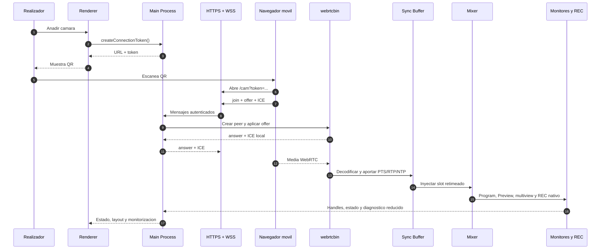

# Visión general y flujo de datos de OpenMix-CG

## Para qué sirve este documento

Este documento da una vista de conjunto del sistema antes de entrar en tecnologías concretas como Electron, GStreamer o WebRTC.

Su objetivo es responder tres preguntas:

1. Que módulos componen OpenMix-CG.
2. Cómo se relacionan entre sí.
3. Como viajan los datos desde una cámara móvil hasta la interfaz del realizador.

## Bloques principales

OpenMix-CG se apoya en cuatro bloques principales:

- **Renderer React**: la interfaz que usa el realizador.
- **Preload + IPC**: la capa segura que conecta la UI con el proceso principal.
- **Electron Main Process**: el orquestador que arranca servicios, valida límites del sistema y coordina los módulos.
- **Backend multimedia nativo**: GStreamer y WebRTC ejecutados a traves del addon nativo.

## Mapa de módulos

```mermaid
flowchart LR
    subgraph UI[Operacion]
        direction TB
        React[Renderer React]
        Panels[Panel mixer, grafismo, audio, atajos]
        React --> Panels
    end

    subgraph Bridge[Puente seguro]
        direction TB
        Preload[Preload API]
        IPC[IPC tipado]
        Preload --> IPC
    end

    subgraph MainArea[Proceso principal]
        direction TB
        MainProc[Electron Main]
        Services[Servicios Main\nMixer, Sources, Graphics, Output, Shortcuts]
        HTTPS[HTTPS local]
        WSS[WSS de senalizacion]
        MainProc --> Services
        Services --> HTTPS
        Services --> WSS
    end

    subgraph Media[Plano de media nativo]
        direction TB
        NativeAddon[Addon N-API GStreamer]
        Ingest[webrtcbin y videos locales]
        Sync[Sync Buffer RTP/NTP]
        GraphicsOverlay[Overlay grafismo alpha]
        Mixer[Mixer GStreamer]
        MediaOutputs[Monitores nativos, multiview y REC]
        NativeAddon --> Ingest
        Ingest --> Sync
        Sync --> Mixer
        GraphicsOverlay --> Mixer
        Mixer --> MediaOutputs
    end

    subgraph Mobile[Cliente movil]
        direction TB
        QR[QR de conexion]
        Browser[Navegador movil]
        QR -->|abre enlace| Browser
    end

    React -->|comandos| Preload
    IPC -->|handlers| MainProc
    Services --> NativeAddon
    Services --> GraphicsOverlay
    Browser -->|carga /cam| HTTPS
    Browser -->|media WebRTC| Ingest
    WSS -->|join, offer e ICE| Services
    MediaOutputs -->|handles, geometria y estado| MainProc
    MainProc -->|estado y control| React


    classDef ui fill:#111827,stroke:#64748b,color:#f8fafc,stroke-width:1.5px;
    classDef renderer fill:#111827,stroke:#64748b,color:#f8fafc,stroke-width:1.5px;
    classDef input fill:#111827,stroke:#64748b,color:#f8fafc,stroke-width:1.5px;
    classDef source fill:#111827,stroke:#64748b,color:#f8fafc,stroke-width:1.5px;
    classDef bridge fill:#111827,stroke:#4f96a7,color:#f8fafc,stroke-width:1.5px;
    classDef composition fill:#111827,stroke:#4f96a7,color:#f8fafc,stroke-width:1.5px;
    classDef control fill:#111827,stroke:#4f96a7,color:#f8fafc,stroke-width:1.5px;
    classDef main fill:#111827,stroke:#8b7a5d,color:#f8fafc,stroke-width:1.5px;
    classDef output fill:#111827,stroke:#8b7a5d,color:#f8fafc,stroke-width:1.5px;
    classDef media fill:#111827,stroke:#8d72aa,color:#f8fafc,stroke-width:1.5px;
    classDef graphics fill:#111827,stroke:#8d72aa,color:#f8fafc,stroke-width:1.5px;
    classDef monitoring fill:#111827,stroke:#8d72aa,color:#f8fafc,stroke-width:1.5px;
    classDef native fill:#111827,stroke:#8d72aa,color:#f8fafc,stroke-width:1.5px;
    classDef mobile fill:#111827,stroke:#4ca6b8,color:#f8fafc,stroke-width:1.5px;
    class React,Panels ui;
    class Preload,IPC bridge;
    class MainProc,Services,HTTPS,WSS main;
    class NativeAddon,Ingest,Sync,GraphicsOverlay,Mixer,MediaOutputs media;
    class QR,Browser mobile;
```

## Idea clave: hay dos planos distintos

En OpenMix-CG conviene distinguir siempre entre estos dos planos:

- **Plano de control**: mensajes, comandos, estados y metadatos.
- **Plano de media**: vídeo, audio, buffers y procesamiento en tiempo real.

Esta separación es una decisión arquitectónica importante.

El plano de control puede pasar por Electron IPC o por WebSocket. El plano de media debe quedarse en GStreamer y WebRTC, porque mover frames grandes por IPC como si fuesen simples mensajes degradaría mucho el rendimiento.

## Flujo de arranque de la aplicación

Cuando se abre OpenMix-CG, el arranque sigue este flujo:

1. Electron crea la ventana principal.
2. Se carga el preload para exponer `window.openMix` al renderer.
3. El Main Process registra handlers IPC del mixer y de las fuentes.
4. El Main genera un certificado TLS autofirmado.
5. El Main arranca el servidor HTTPS que sirve la página móvil.
6. Sobre ese mismo servidor arranca el WebSocket de señalización.

Esto significa que la infraestructura de conexión móvil depende del proceso principal, no del renderer.

## Flujo de datos de una cámara móvil

El recorrido completo de una cámara móvil hasta aparecer en el mixer es este:

## Flujo de datos del mixer hacia la interfaz

Una vez que el mixer está corriendo, el pipeline genera varias salidas:

- **Program**: imagen que está al aire.
- **Preview**: imagen preparada para el siguiente corte.
- **Miniaturas**: vistas reducidas de todas las fuentes.
- **Mensajes de bus**: información de estado, errores y diagnóstico.

No todas estas salidas siguen el mismo camino:

- **Preview y Program grandes**: la ruta de rendimiento preferente usa superficies nativas de GStreamer controladas desde Main. El renderer comunica geometría y estado, pero no debería transportar esos frames como IPC crudo.
- **Multiview**: es monitorización reducida y, en modo nativo, se presenta como superficie de GStreamer a baja resolución y 15fps.
- **Miniaturas y buffers diagnósticos**: pueden seguir usando rutas reducidas porque no son la salida final ni la ruta de grabación.
- **Mensajes de bus y estado**: vuelven al Main Process desde el addon nativo y se reenvían al renderer como plano de control.

La regla importante es que React presenta y controla la realización, pero no debe convertirse en el mezclador de vídeo.

## Papel de cada módulo

### Electron e IPC

Sirve para separar la interfaz del código privilegiado y mantener contratos claros entre procesos.

### GStreamer y mixer

Sirve para mezclar fuentes, construir Program y Preview, mantener el pipeline vivo y producir las salidas de monitorización.

### WebRTC y señalización local

Sirve para conectar móviles sin instalar una app nativa, negociando la sesión y transportando la media con baja latencia.

### Terminología audiovisual y operativa

Sirve para traducir el lenguaje técnico del software al lenguaje que se usa durante la operación audiovisual.

## Líneas de evolución técnica

Aunque la arquitectura ya es funcional para producción local de prueba, se
mantienen puntos importantes como evolución técnica:

- **Ajuste fino de audio por claqueta**: REC nativo ya puede grabar audio local
  y aplicar delay real a su rama GStreamer. La validación operativa de
  palmada/claqueta servirá para fijar el signo y la magnitud del desfase
  residual, y para decidir una futura mezcla live con `audiomixer` para
  Program/streaming.
- **Grafismo por textura compartida**: línea experimental para reducir copias
  CPU de los overlays HTML sin condicionar la ruta funcional validada.

La arquitectura principal integra el Sync Buffer Manager RTP/NTP
para multicámara, los vídeos locales como fuentes reproducibles del mixer, la
multiview nativa reducida y el panel de atajos configurables. También existe una
primera pestaña de audio en modo diagnóstico local: permite elegir entrada, ver
medidor/onda, activar una referencia visual nativa de Preview, detectar un pico
de palmada y calcular un delay sugerido. Ese delay ya puede aplicarse a la rama
de audio local de REC nativo; la mezcla live de Program/streaming se mantiene como
evolución posterior. Los clips se cargan desde Main, entran en GStreamer como media
nativa y se controlan desde React solo mediante IPC de control. Los atajos
siguen la misma regla: son una forma de expresar acciones existentes del
operador y no transportan media ni conocen detalles del pipeline nativo.

## Ruta de lectura recomendada

Para revisar la documentación técnica de forma ordenada:

1. Leer primero este archivo para tener un mapa mental global.
2. Ir después al documento de Electron e IPC para entender la base de la aplicación.
3. Pasar a GStreamer y mixer para ver el núcleo multimedia.
4. Leer WebRTC y señalización para entender la conexión de cámaras móviles.
5. Usar la terminología audiovisual para traducir todo eso a lenguaje de realización.
