# Módulo 1. Electron e IPC

## Para qué sirve este módulo

Este módulo explica la base estructural de OpenMix-CG: cómo se separan interfaz, lógica privilegiada y acceso seguro entre procesos.

Sin este bloque, la aplicación sería mucho más difícil de asegurar, mantener y explicar conceptualmente.

## Idea central

Electron no es un programa monolitico donde todo vive en el mismo sitio. En OpenMix-CG hay tres piezas diferenciadas:

- **Main Process**: orquesta servicios y operaciones privilegiadas.
- **Renderer Process**: dibuja la interfaz y recibe la interacción del usuario.
- **Preload**: expone una API pequeña y controlada entre ambos.

## Reparto de responsabilidades

| Capa             | Que hace en OpenMix-CG                                                     | Que no debe hacer                                       |
| ---------------- | -------------------------------------------------------------------------- | ------------------------------------------------------- |
| Main Process     | Arrancar servicios, cargar GStreamer, gestiónar HTTPS/WSS, validar límites | Mezclar lógica de negocio con detalles visuales         |
| Preload          | Publicar `window.openMix` con funciones concretas                          | Exponer `ipcRenderer` entero o contener mucha lógica    |
| Renderer Process | Mostrar la UI, QR, estados, botones y contenedores/layout de monitor       | Tocar GStreamer o transportar vídeo pesado directamente |

## Flujo de control entre procesos

```mermaid
flowchart LR
    subgraph Renderer[Renderer]
        direction TB
        UI[React UI]
    end

    subgraph Bridge[Secure bridge]
        direction TB
        Preload[Preload API]
    end

    subgraph MainProcess[Main Process]
        direction TB
        Ipc[IPC handler]
        Service[MixerService]
    end

    Native[Addon nativo]

    UI -->|Cut request| Preload
    Preload -->|invoke| Ipc
    Ipc -->|service call| Service
    Service -->|native control| Native


    classDef ui fill:#111827,stroke:#64748b,color:#ffffff,stroke-width:1.5px;
    classDef renderer fill:#111827,stroke:#64748b,color:#ffffff,stroke-width:1.5px;
    classDef input fill:#111827,stroke:#64748b,color:#ffffff,stroke-width:1.5px;
    classDef source fill:#111827,stroke:#64748b,color:#ffffff,stroke-width:1.5px;
    classDef bridge fill:#111827,stroke:#4f96a7,color:#ffffff,stroke-width:1.5px;
    classDef composition fill:#111827,stroke:#4f96a7,color:#ffffff,stroke-width:1.5px;
    classDef control fill:#111827,stroke:#4f96a7,color:#ffffff,stroke-width:1.5px;
    classDef main fill:#111827,stroke:#8b7a5d,color:#ffffff,stroke-width:1.5px;
    classDef output fill:#111827,stroke:#8b7a5d,color:#ffffff,stroke-width:1.5px;
    classDef media fill:#111827,stroke:#8d72aa,color:#ffffff,stroke-width:1.5px;
    classDef graphics fill:#111827,stroke:#8d72aa,color:#ffffff,stroke-width:1.5px;
    classDef monitoring fill:#111827,stroke:#8d72aa,color:#ffffff,stroke-width:1.5px;
    classDef native fill:#111827,stroke:#8d72aa,color:#ffffff,stroke-width:1.5px;
    classDef mobile fill:#111827,stroke:#4ca6b8,color:#ffffff,stroke-width:1.5px;
    class UI renderer;
    class Preload bridge;
    class Ipc,Service main;
    class Native native;
```

La clave aquí es que el renderer no conoce los detalles internos del sistema. Solo ve una API de alto nivel.

En la práctica, si el ejemplo concreto es un CUT, el recorrido real sería este:

1. La UI llama a `window.openMix.mixer.cut()`.
2. El preload traduce esa intencion a una llamada IPC.
3. El Main Process la recibe en un handler.
4. El handler delega en `MixerService`.
5. `MixerService` ordena al addon nativo ejecutar la accion.

## Conceptos principales

### Main Process

Es el proceso privilegiado de Electron. En OpenMix-CG es quien crea la ventana principal, registra handlers IPC, arranca el servidor HTTPS, el WebSocket de señalización y coordina el addon nativo.

### Renderer Process

Es el proceso donde corre React y donde se dibuja la interfaz. Su papel es recoger la intencion del realizador y mostrar estado, no ejecutar directamente la lógica multimedia pesada.

### Preload

Es la capa de adaptación entre el renderer y el main. En OpenMix-CG publica una API `window.openMix` con funciones concretas como iniciar el mixer, pedir un token o suscribirse a eventos.

### contextBridge

Es el mecanismo que usa Electron para exponer la API del preload de manera segura. Su importancia es que permite abrir una puerta muy estrecha entre procesos, en vez de dar acceso general a Node.js desde la UI.

### IPC tipado

Es la forma de comunicar procesos usando estructuras compartidas y previsibles. En OpenMix-CG esto reduce errores y hace que la interfaz y el proceso principal compartan el mismo vocabulario técnico.

### `IpcResult<T>`

Es el patrón común de respuesta usado por muchos handlers IPC. Obliga a diferenciar entre éxito y error antes de consumir el dato, lo cual es muy útil para documentar el comportamiento esperado del sistema.

## Plano de control frente a plano de media

Esta es una de las ideas más importantes de la arquitectura:

- **Plano de control**: comandos, respuestas, estados, errores y metadatos.
- **Plano de media**: frames, audio, buffers y rutas de vídeo en tiempo real.

En OpenMix-CG, Electron IPC debe usarse casi solo para el plano de control.

Durante fases tempranas, los frames de Preview/Program viajaban por IPC porque era la forma más simple de validar el mixer. Ese camino queda como ruta legacy o de diagnóstico. La ruta de rendimiento preferente para los monitores grandes usa superficies nativas de GStreamer: el renderer envía geometría, estados y acciones, pero no recibe cada frame como un mensaje IPC.

Las miniaturas diagnósticas y algunas previews reducidas pueden seguir usando rutas de monitorización especificas porque no representan la salida final ni la ruta de grabación. La multiview reducida tiene ruta nativa y ruta WebRTC bajo guarda, pero tampoco debe arrastrar Preview/Program grandes a IPC crudo.

## Flujo tipico de una accion de usuario

### Ejemplo: pulsar CUT

1. El realizador pulsa el boton CUT en la interfaz React.
2. El renderer llama a `window.openMix.mixer.cut()`.
3. El preload traduce esa llamada a `ipcRenderer.invoke('mixer:cut')`.
4. El Main Process recibe la peticion con un handler registrado.
5. Ese handler llama a `MixerService.cut()`.
6. El servicio invoca al addon nativo para cambiar el estado del mixer.
7. La UI recibe el nuevo estado cuando vuelve a consultar o cuando el Main notifica cambios de fuente, geometría o disponibilidad de superficies.

### Ejemplo: ejecutar CUT con atajo configurable

Los atajos de teclado no abren una ruta nueva hacia GStreamer. Son una forma
alternativa de expresar la misma intencion que un boton.

1. Main Process lee y persiste `keyboard-shortcuts.json` en `userData`.
2. El Renderer obtiene esa configuración vía `window.openMix.shortcuts`.
3. Cuando el operador pulsa una combinación, React la compara con los atajos
   activos.
4. Si hay coincidencia, el Renderer llama a la API existente correspondiente
   (`window.openMix.mixer.cut()`, `graphics.showItem()`, etc.).
5. El preload y los handlers IPC siguen siendo los mismos límites de seguridad
   del sistema.

Esta decisión es importante para mantener la separación de responsabilidades: el atajo pertenece al plano de control
y no debe transportar frames ni conocer detalles internos del pipeline nativo.

### Ejemplo: panel de audio en modo diagnóstico

La primera pestaña de audio usa Web Audio en el Renderer para una finalidad muy
acotada: visualizar una entrada local, detectar picos y estimar un delay de
sincronización por palmada/claqueta.

La onda no representa una mezcla final: es un historial rodante de la entrada
local para que el operador pueda ver el pico de la palmada durante varios
segundos. La pestaña incluye una referencia visual ligera del Preview usando una
superficie nativa de GStreamer (`GstVideoOverlay`) a baja resolución, no un peer
WebRTC local ni frames grandes por IPC. Esa referencia permite seleccionar la
fuente que entra a Preview y marcar la palmada sin volver al mixer principal.
El monitor de referencia está apagado por defecto: cuando el operador no lo
activa, su `valve` permanece cerrada y GStreamer no presenta esa salida.

El panel mantiene además un buffer visual de miniaturas para poder congelar la
claqueta y escoger el frame exacto. Esas miniaturas son reducidas
(`320x180`, 30fps) y solo se envían mientras el monitor de referencia esta
activo. Es una excepcion diagnóstica acotada: la imagen live se presenta por
superficie nativa y el IPC solo transporta imágenes pequeñas para el análisis de
calibración, no la ruta de media principal.

Esta decisión sustituye la prueba provisional basada en reutilizar el endpoint
WebRTC local de PVW. Renegociar ese `webrtcbin` compartido desde la pestaña
Audio podía quedarse en `connecting` o interferir con el mixer al activarse y
desactivarse varias veces. La solución de producto es una referencia nativa o
una rama diagnóstica independiente, no resetear en caliente el endpoint WebRTC
compartido del mixer.

Para evitar que el cálculo dependa del tiempo de reaccion del operador, el
panel guarda un buffer visual corto con miniaturas de baja resolución. Cuando se
detecta el pico de audio, no se congela inmediatamente: se mantiene un
post-roll configurable para dejar entrar los frames de vídeo que llegan con más
latencia que el sonido. Después se congela y el operador puede escoger con calma
el frame donde se ve la palmada. Si el pico de audio aparece antes que la
palmada visible, el delay sugerido será positivo y significa "retrasar el
audio". Si aparece después, el valor será negativo y en la integración nativa
habrá que decidir si se retrasa el vídeo o si se acepta esa latencia.

No hay muestras de audio viajando por Electron IPC. La captura Web Audio del
Renderer sigue siendo diagnóstica: produce nivel, pico, onda y delay sugerido.
El control que cruza IPC es solo metadato serializable, por ejemplo
`mixer:set-recording-audio-delay` con el delay en milisegundos.

La primera aplicación real del delay vive en el plano nativo: con
`OPENMIX_RECORDING_AUDIO=on`, la rama dinámica de REC captura una entrada local
en GStreamer (`osxaudiosrc` en macOS, o `autoaudiosrc` como fallback), aplica el
delay con `identity ts-offset` y mezcla ese audio con el contenedor de grabación.
El `audiomixer` con varias fuentes, mute/nivel por fuente y mezcla live de
Program/streaming queda como extensión posterior.

## Flujo tipico de un evento que vuelve hacia la interfaz

### Ejemplo: actualizar el monitor de Preview

1. GStreamer produce Preview dentro del pipeline nativo.
2. Si el monitor grande está en modo nativo, el addon presenta la imagen en una superficie de GStreamer.
3. El renderer informa al Main de la geometría del panel para colocar esa superficie.
4. Si se usa una ruta legacy o de diagnóstico, el addon puede entregar frames reducidos al Main para que el renderer los pinte en canvas.

La UI no calcula el frame: decide donde debe verse y expresa la intencion del operador.

## Por qué esta separación es importante

Esta arquitectura no es un detalle accidental. Resuelve varios problemas a la vez:

- **Seguridad**: la UI no tiene acceso libre a APIs privilegiadas.
- **Claridad**: cada capa tiene una responsabilidad comprensible.
- **Mantenibilidad**: WebRTC, mixer y UI pueden evolucionar sin quedar completamente acoplados.
- **Revisión técnica**: permite explicar el proyecto como un sistema por capas y no como un conjunto de scripts mezclados.

## Resumen corto que conviene recordar

Si hubiera que resumir este módulo en una frase, una buena idea sería esta:

> Electron aporta la estructura por capas; el preload expone una API segura y tipada; la UI decide que hacer y el Main Process ejecuta las acciones privilegiadas.
