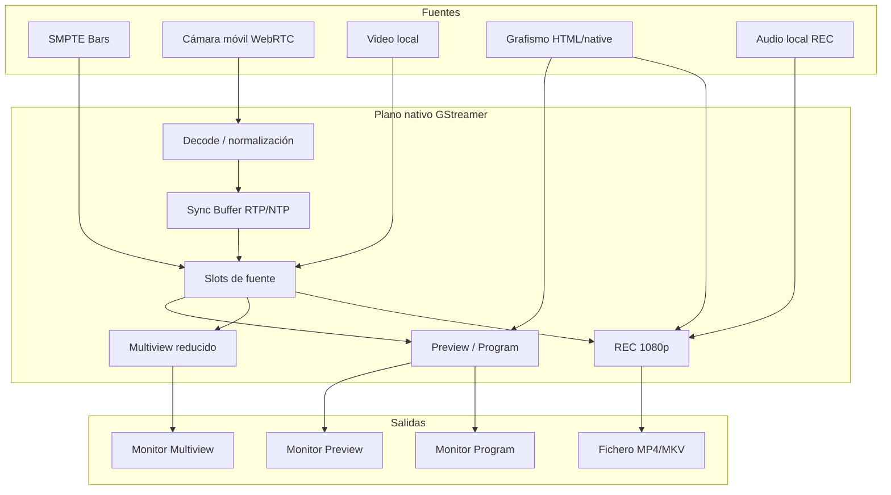
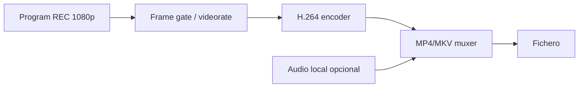

# Módulo 2. GStreamer y mixer

## Para qué sirve este módulo

Este módulo describe el núcleo multimedia de OpenMix-CG: el addon nativo, el
pipeline de GStreamer y las rutas que producen Program, Preview, multiview y
grabación local.

La idea principal es sencilla: React y Electron controlan la realización, pero
no mezclan vídeo. Las rutas pesadas de media permanecen dentro de GStreamer.

## Idea central

OpenMix-CG separa dos planos:

- **Plano de control**: órdenes de operación, estados, geometría de ventanas,
  selección de fuentes, REC, atajos y mensajes de error.
- **Plano de media**: vídeo, audio, buffers, clocks, colas, decoders,
  compositores y encoder de grabación.

Electron IPC pertenece al plano de control. GStreamer pertenece al plano de
media. Esta separación evita que frames 1080p o buffers de audio viajen por IPC
como mensajes JavaScript.

## Papel del addon nativo

El addon nativo conecta el Main Process de Electron con GStreamer mediante
N-API. Desde JavaScript se ve como un único módulo Node.js
(`gstreamer_addon.node`), pero internamente agrupa dominios separados:

- `addon/`: punto de entrada N-API, tabla de exports, estado global y
  preparación de GStreamer.
- `common/`: utilidades compartidas para elementos, pads y propiedades.
- `mixer/`: pipeline principal, selectores, transiciones y configuración de
  monitorización, multiview, WebRTC, grafismo y REC.
- `webrtc/`: peers, negociación, ramas H.264, jitterbuffer y callbacks.
- `monitors/`: Program, Preview, multiview, HUD y superficies nativas.
- `graphics/`: recepción y composición de frames RGBA/BGRA con alpha.
- `recording/`: rama nativa de grabación, audio local, overlays y cierre por
  EOS.
- `local_video/`: carga y control de vídeos locales como fuentes del mixer.
- `sync/`: Sync Buffer Manager multicámara basado en RTP/NTP.

La frontera pública sigue siendo pequeña: Electron invoca acciones de alto
nivel, y el addon decide cómo materializarlas dentro del pipeline.

## Flujo general

El flujo muestra tres ideas clave:

1. Las fuentes se normalizan antes de entrar al mixer.
2. Program, Preview, multiview y REC son salidas distintas del mismo plano de
   media.
3. La UI no recibe la media pesada; recibe estados y controla acciones.

## Rutas principales de la versión publicada

| Ruta | Papel | Implementacion validada |
| --- | --- | --- |
| Program y Preview | Monitores grandes de operación | Superficies nativas de GStreamer controladas desde Main |
| Multiview | Vista reducida de fuentes y slot GFX | Mosaico reducido a 15fps con HUD y barras estáticas |
| Cámaras móviles | Fuentes WebRTC locales | `webrtcbin`, decode H.264, Sync Buffer y slot dedicado |
| Vídeos locales | Fuentes pinchables desde disco | `uridecodebin`, retiming local y control desde IPC |
| Grafismo | Overlay sobre PVW/PGM/REC | Frames con alpha hacia GStreamer |
| REC | Grabación local de Program | Rama nativa 1080p con encoder, muxer y audio local opcional |

Las rutas de diagnóstico y compatibilidad existen para medir o aislar problemas,
pero no son la presentación principal del producto.

## Fuentes del mixer

### Barras SMPTE

La fuente 0 es una fuente sintética de barras SMPTE. Sirve como referencia
visual, como fallback de operación y como fuente estable cuando no hay cámaras
conectadas.

### Cámaras WebRTC

Cada cámara móvil llega a través de un peer WebRTC. El flujo se recibe como RTP
H.264, se decodifica y se inserta en un slot del mixer. Antes de llegar a las
salidas, la rama pasa por el Sync Buffer Manager para normalizar tiempos y
permitir alineación multicámara.

La rama se divide conceptualmente en dos calidades:

- una ruta de monitorización, pensada para Preview, Program y multiview;
- una ruta master/REC, preparada para conservar 1080p cuando el emisor lo
  permite.

Esta separación permite grabar a mayor calidad sin obligar a todos los monitores
de operación a trabajar siempre en 1080p.

### Vídeos locales

Los vídeos locales se cargan desde Main Process y entran al pipeline mediante
GStreamer. La UI solo elige fichero, slot y acciones de control. El avance,
pausa, reinicio, loop y política Auto Program se resuelven en el plano nativo.

Para que un fichero se comporte como una fuente live, el bin local reancla sus
timestamps al tiempo de ejecución del mixer. Así un clip puede entrar por CUT o
volver a barras sin que el compositor lo trate como un frame atrasado.

### Grafismo

El motor de grafismo genera frames con alpha. Esos frames entran en GStreamer
como overlay y se mezclan con Program, Preview y REC. El módulo de grafismo se
explica con más detalle en
[05-grafismo-y-rotulos.md](05-grafismo-y-rotulos.md) y
[06. Grafismo nativo y modelo híbrido](06-grafismo-nativo-y-modelo-hibrido.md).

## Program, Preview y transiciones

OpenMix-CG usa el paradigma clásico de realización:

- **Program** es la salida activa.
- **Preview** es la fuente preparada para entrar.
- **CUT** intercambia Program y Preview.
- **AUTO** realiza una transición temporal hacia Program.

La implementación no necesita reconstruir el pipeline en cada corte. Las fuentes
entran a selectores y, cuando hace falta composición real, a compositores. En el
caso común se evita mantener todas las entradas vivas dentro de todos los
compositores, porque eso eleva el coste CPU aunque visualmente solo haya una
fuente activa.

El principio operativo es:

1. Program tiene una fuente seleccionada.
2. Preview tiene otra fuente preparada.
3. CUT cambia las selecciones.
4. AUTO abre temporalmente la fuente saliente y la entrante para mezclar.
5. Los grafismos se colocan como capa con alpha sobre la salida correspondiente.

## Monitorización

### Preview y Program

Los monitores grandes usan superficies nativas cuando
`OPENMIX_BIG_MONITORS_SURFACE=native`. El renderer envía geometría y estado; el
Main Process coloca la superficie y GStreamer pinta directamente sobre ella.

Esto evita transportar frames grandes por Electron IPC. La interfaz sigue
controlando la realización, pero la presentación de vídeo permanece en el plano
nativo.

### Multiview

La multiview es una salida reducida para supervisar fuentes. La ruta validada
trabaja a 15fps, dibuja HUD dentro del propio frame y mantiene las barras SMPTE
como referencia estática. Su objetivo no es sustituir a Program o Preview, sino
dar contexto operativo a bajo coste.

La multiview puede presentarse por superficie nativa o por una ruta WebRTC local
de diagnóstico. En el perfil validado, la ruta nativa mantiene la media dentro
de GStreamer y evita depender del DOM para dibujar nombres y bordes de slots.

### Referencia visual de audio

El panel de audio puede activar una referencia visual ligera tomada de Preview.
Esa referencia sirve para localizar una palmada o claqueta al calcular delay de
audio. Permanece apagada por defecto y no forma parte de la ruta normal de
Program/Preview.

## Sync Buffer Manager

El Sync Buffer Manager vive entre la decodificación WebRTC y las salidas del
mixer. Su función es normalizar el tiempo de cada cámara y, cuando hay varias
fuentes móviles, aplicar un retardo compensatorio basado en RTP/NTP.

La capa básica usa:

- una cola posterior a decode para absorber ráfagas cortas;
- normalización de PTS al `running-time` del mixer;
- lectura de RTCP Sender Reports mediante `rtpjitterbuffer`;
- aplicación opcional de delay NTP cuando hay al menos dos cámaras decodificadas.

La regla de seguridad es importante: una sola cámara debe comportarse como una
ruta prácticamente pasante. No hay nada que sincronizar si solo existe una
fuente móvil, por lo que el manager no debe introducir latencia ni diagnóstico
innecesario en ese caso.

## Grabación nativa

REC usa una rama propia dentro del pipeline de GStreamer. No escribe frames
1080p desde Electron ni desde React. Cuando el operador pulsa REC, el addon
conecta una rama dinámica con encoder, muxer y `filesink`; después abre las
entradas que pueden aparecer en Program.

La grabación mantiene tres criterios:

- el fichero debe empezar en `t=0`, aunque el mixer lleve tiempo funcionando;
- los cambios de fuente no deben crear segundos extra de vídeo congelado;
- STOP REC debe enviar EOS al muxer para que el contenedor se cierre de forma
  reproducible.

Si una cámara se desconecta durante REC, la grabación no se detiene
automáticamente. El slot pasa a negro o a la fuente que seleccione el operador.
Si se apaga el mixer o se cierra la aplicación, REC se finaliza antes de destruir
el pipeline para que el fichero pueda escribir su índice final.

## Conceptos GStreamer necesarios

### Pipeline

Cadena de elementos que transporta y procesa media. En OpenMix-CG contiene
fuentes, decoders, colas, selectores, compositores, overlays, encoder y muxer.

### Bus

Canal de mensajes del pipeline. Permite observar cambios de estado, warnings y
errores relevantes.

### Pad

Punto de entrada o salida de un elemento GStreamer. Algunos pads son estaticos y
otros se solicitan dinamicamente, por ejemplo al anadir entradas a un
compositor.

### appsrc y appsink

`appsrc` permite introducir buffers creados por la aplicación en GStreamer.
`appsink` permite extraer buffers hacia código de aplicación. En la ruta de
producto, `appsrc` se usa para grafismo y `appsink` queda restringido a
diagnóstico, miniaturas o buffers reducidos.

### input-selector

Elemento que permite elegir una entrada activa entre varias. Es clave para
mantener slots estables sin reconstruir el pipeline en cada CUT.

### compositor

Elemento que mezcla varias entradas de vídeo en una sola salida. Se usa cuando
hay transiciones, grafismo con alpha o composición real de varias capas.

### valve

Elemento que deja pasar o bloquea buffers. OpenMix-CG lo usa para cerrar ramas
que no deben consumir CPU cuando no son visibles o cuando REC esta apagado.

### Preroll

Etapa de preparación antes de producir salida live. Es importante en pipelines
con fuentes dinamicas, porque una rama que no entrega datos puede bloquear la
transición a `PLAYING`.

### Z-order y alpha

`alpha` decide la transparencia de una entrada. `z-order` decide que capa queda
encima. Ambos son necesarios para ordenar vídeo base, transiciones y grafismos.

## Rutas de diagnóstico y compatibilidad

La versión publicada mantiene algunas guardas para aislar problemas o comparar
coste:

- `OPENMIX_MONITOR_IPC`: controla si se extraen frames PGM/PVW hacia JS.
- `OPENMIX_MONITOR_RENDERER`: permite comparar selector, compositor y A/B.
- `OPENMIX_MULTIVIEW_SURFACE`: compara multiview nativa y WebRTC local.
- `OPENMIX_SYNC_BUFFER_STATS`: activa diagnóstico del Sync Buffer.
- `OPENMIX_RECORDING_FRAME_GATE_LOG`: registra decisiones del frame gate de REC.

Estas rutas no cambian el principio arquitectonico: el comportamiento normal de
producto mantiene la media pesada dentro de GStreamer. Los detalles de
diagnóstico, mediciones y decisiones de compatibilidad se agrupan en
[../Notas/gstreamer-detalles-operativos.md](../Notas/gstreamer-detalles-operativos.md).

## Relacion con otros módulos

- [01-electron-e-ipc.md](01-electron-e-ipc.md): explica la frontera Main,
  Preload y Renderer.
- [03. WebRTC y señalización local](03-webrtc-y-senalizacion-local.md):
  explica la conexión de cámaras móviles.
- [05-grafismo-y-rotulos.md](05-grafismo-y-rotulos.md): explica el motor de
  plantillas y overlays.
- [06. Grafismo nativo y modelo híbrido](06-grafismo-nativo-y-modelo-hibrido.md):
  explica el modelo híbrido de grafismo.

## Resumen corto

GStreamer es el motor que mezcla las fuentes. El addon nativo lo conecta con
Electron. Program, Preview, multiview y REC se generan como salidas del plano de
media, mientras React solo expresa decisiones de operación.
