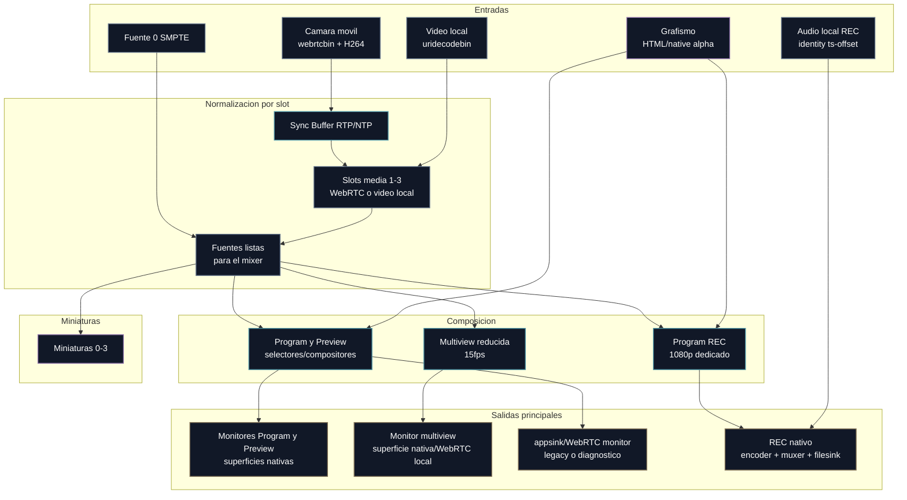
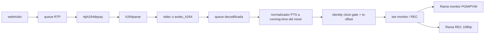
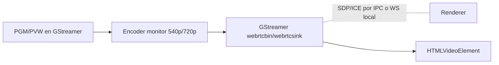
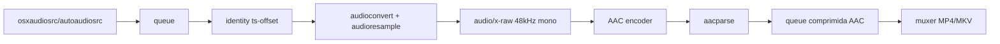

# Módulo 2. GStreamer y mixer

## Para qué sirve este módulo

Este módulo explica el núcleo multimedia de OpenMix-CG: el addon nativo, el pipeline del mixer y la lógica que produce Program, Preview y miniaturas.

Es la parte que convierte el proyecto en una herramienta de realización real y no solo en una interfaz bonita.

## Idea central

GStreamer es el motor de procesamiento de vídeo. OpenMix-CG no mezcla las fuentes en React ni en Electron puro, sino dentro de un pipeline nativo controlado desde el Main Process.

## Papel del addon nativo

El addon nativo es la pieza que conecta dos mundos:

- El mundo JavaScript y TypeScript del proceso principal.
- El mundo C++ y GStreamer del procesamiento multimedia.

Gracias a N-API, el proyecto puede cargar ese addon como un módulo Node.js y pedirle acciones concretas como:

- inicializar GStreamer,
- crear el pipeline del mixer,
- arrancarlo o detenerlo,
- cambiar las fuentes de Program y Preview,
- crear peers WebRTC.

### Estructura interna del addon

El addon se organiza por carpetas de dominio dentro de `src/native/`:

- `addon/`: punto de entrada N-API (`gstreamer_addon.cpp`), tabla de exports,
  estado global, cableado entre contextos y preparación del entorno GStreamer.
- `common/`: utilidades compartidas pequeñas, por ejemplo helpers para
  elementos y propiedades GStreamer.
- `mixer/`: creación del pipeline principal, selectores Preview/Program,
  transiciones, pads, referencias runtime, acciones de control y configuración
  runtime separada por dominios (`monitor`, `multiview`, `webrtc/sync`,
  `graphics` y `recording`).
- `webrtc/`: peers, negociación WebRTC, ramas H.264, estadísticas RX,
  jitterbuffer y callbacks de señalizacion.
- `monitors/`: salidas de monitorización, multiview nativa, HUD, diagnóstico y
  controles de superficies nativas/WebRTC.
- `graphics/`: recepción y composición de frames RGBA de grafismo sobre el
  pipeline.
- `recording/`: rama de grabación, overlays en REC, audio local, probes y cierre
  por EOS.
- `local_video/`: carga, control y publicación de vídeos locales como fuentes.
- `sync/`: Sync Buffer Manager multicámara basado en RTP/NTP.

Esta separación no cambia la frontera arquitectónica: JavaScript sigue viendo
un solo addon `gstreamer_addon.node`. Internamente, cada dominio mantiene sus
responsabilidades cerca de los elementos GStreamer que controla, lo que facilita
seguir el flujo de media sin mezclar pipeline, WebRTC, REC, monitores y
grafismos en el mismo punto de entrada.

## Flujo general del mixer

## Por qué existen dos salidas de composición

El modelo operativo de OpenMix-CG necesita dos salidas simultaneas porque Program y Preview deben existir al mismo tiempo y mostrar fuentes distintas.

- **Program**: la señal que está al aire.
- **Preview**: la siguiente fuente preparada para entrar.

En la implementación original esas dos salidas se resolvían con dos `compositor` completos. En las rutas optimizadas se conserva la misma semántica, pero se permite que el caso común use `input-selector` y que el `compositor` solo intervenga cuando hay transiciones o capas con alpha. Así la arquitectura sigue explicándose como Program + Preview, sin imponer que ambos monitores paguen siempre el coste de un compositor general.

La razón original para usar `compositor` en Program y Preview no era solo seleccionar una fuente. También prepara el camino para operaciones que sí necesitan composición real:

- superponer grafismos con alpha sobre Program o Preview,
- ejecutar transiciones donde dos fuentes conviven durante varios frames,
- respetar z-order entre vídeo base, grafismo y futuras capas,
- mantener una salida estable aunque cambien las fuentes internas.

La medición de rendimiento ha mostrado un matiz importante: un `compositor force-live=true` produciendo siempre a 30fps tiene un coste apreciable aunque no haya frames visibles ni callbacks hacia Electron. Por tanto, la arquitectura objetivo no debe eliminar los compositores, sino usarlos de forma selectiva. El caso común de monitorización puede resolverse con una ruta barata de selección (`input-selector` o equivalente) y mantener el compositor solo con las capas que realmente pueden verse: vídeo al aire, vídeo entrante durante transición y grafismo. Así se conserva la capacidad completa del mixer sin pagar el coste de cuatro entradas live por monitor en todos los frames.

## Conceptos principales

### Addon nativo

Es el módulo C++ que encapsula GStreamer y expone una API utilizable desde Node.js. En el proyecto actúa como frontera clara entre el entorno multimedia nativo y el resto de la aplicación Electron.

### N-API

Es la interfaz de Node.js para construir addons nativos. Su valor aquí no es solo técnico: también deja claro que el proyecto no ejecuta GStreamer como una caja negra externa, sino como parte integrada de la aplicación.

### ThreadSafeFunction

Es el mecanismo usado para enviar callbacks desde hilos nativos de GStreamer hacia JavaScript sin romper la seguridad del runtime. En la práctica, sirve para reenviar frames y mensajes del bus al Main Process.

### Pipeline de GStreamer

Es la cadena de elementos que define el flujo del vídeo. En el pipeline del mixer, el recorrido contiene fuentes, colas, compositores, `appsink` para salida de monitorización, una rama nativa de grabación y selectores de entrada para conectar las cámaras WebRTC directamente al mixer.

### Bus de GStreamer

Es el canal interno de mensajes del pipeline. Permite saber si el sistema ha cambiado de estado, si se ha producido un warning o si existe un error multimedia relevante.

### appsink

Es un elemento que extrae frames del pipeline hacia código de aplicación. En OpenMix-CG se mantiene para miniaturas, diagnóstico y rutas legacy de monitorización. Ya no debe ser el camino principal de Program/Preview grandes ni de grabación, porque esas rutas deben permanecer en el plano de media.

### appsrc

Es el elemento contrario: permite empujar buffers creados por la aplicación hacia un pipeline. En OpenMix-CG se sigue usando para grafismo nativo y para caminos históricos de compatibilidad.

La ruta validada para slots WebRTC usa `input-selector`: el stream decodificado se enlaza dentro del mismo pipeline del mixer y ya no necesita extraerse con `appsink` para reinyectarse con `appsrc`.

### Rutas dinámicas de fuentes: WebRTC y vídeo local

Cada peer WebRTC se recibe en un `GstBin` dinámico. Dentro de ese bin, `webrtcbin` entrega RTP H.264, se decodifica a vídeo raw y después se divide en dos ramas:

- Rama de monitor: normaliza a I420 en el raster de PGM/PVW configurado desde
  la interfaz. El valor por defecto de los ajustes persistentes es 360p
  (`640x360`), aunque el operador puede seleccionar 540p, 720p o 1080p para
  pruebas o monitores más exigentes. Esta rama alimenta los compositores o
  selectores de monitorización. En la ruta nativa, Program/Preview se presentan
  con sinks de GStreamer; en rutas legacy o de diagnóstico pueden terminar en
  `appsink`.
- Rama REC/master: normaliza a I420 en 1920x1080 y alimenta un selector separado que llega al compositor de grabación. Tiene una `valve` propia que permanece cerrada cuando REC está apagado.

La razón didáctica es separar calidad de salida y coste de monitorización. El móvil puede capturar 1080p para que la grabación sea real, pero los monitores no tienen por qué componer ni cruzar por Electron a 1080p.

### Ramas nativas de monitorización

Preview y Program grandes usan superficies nativas cuando
`OPENMIX_BIG_MONITORS_SURFACE=native`. El Renderer no recibe los frames: solo
publica la geometría del contenedor y el Main Process coloca una ventana host
sobre esa zona. El addon conecta el sink de GStreamer a esa ventana mediante
`GstVideoOverlay`.

La multiview sigue siendo una salida reducida, pero puede presentarse por la
misma técnica nativa. El compositor `comp_multiview` produce un mosaico a
`1280x180` y `15fps`; una rama va al sink nativo y la ruta WebRTC local queda
como fallback/diagnóstico. Como una ventana nativa queda por encima del DOM,
los bordes y nombres de slot se dibujan dentro del propio frame con
`cairooverlay`. La guarda `OPENMIX_MULTIVIEW_HUD=off` permite medir la
diferencia de coste si hace falta aislar ese dibujado. Cuando esa guarda esta
apagada, el elemento `cairooverlay` no se inserta en la pipeline: no basta con
no pintar dentro del callback, porque el propio overlay puede forzar conversión
CPU de frames aunque no dibuje nada.

La selección de superficie de multiview es independiente de Preview/Program:
`OPENMIX_BIG_MONITORS_SURFACE=native` mantiene los monitores grandes en
GStreamer, pero `OPENMIX_MULTIVIEW_SURFACE=webrtc|native` decide solo la tira
multicámara. Las primeras pruebas A/B mostraron que el problema no era solo la
superficie final: con Preview/Program nativos, una cámara y multiview apagada,
Main quedo en `41-47%`; con multiview WebRTC subio a `55-60%`; con multiview
nativa quedó en `58-64%`. La conclusion fue que había que abaratar la rama que
construye el mosaico antes de discutir si se presenta por WebRTC o por ventana
nativa.

Tras limitar la cadencia de entrada, cerrar slots inactivos y representar las
barras de forma estática, el perfil operativo de la rama principal queda con
multiview nativa a 15fps, HUD activo y `OPENMIX_MULTIVIEW_BARS=static`. En la
prueba del 2026-06-02 con dos cámaras, Sync Buffer NTP y stats WebRTC apagadas,
el tramo estable final quedo alrededor de `47.5%` total y `46.6%` en Main. La
superficie WebRTC sigue disponible como fallback/A-B, pero la ruta nativa ya no
se considera una línea experimental pendiente: es parte del perfil operativo
validado.

La primera guarda de optimización de esa rama es
`OPENMIX_MULTIVIEW_SOURCE_FPS`. Con valor `15` por defecto, cada slot pasa por
`videorate drop-only=true` antes de `videoscale`, `videoconvert` y
`comp_multiview`. Así se descartan frames antes de las operaciones caras en vez
de producir un mosaico final a 15fps tras haber procesado todas las entradas a
30fps. El valor `0` desactiva esta limitación para pruebas A/B.

La segunda guarda es `OPENMIX_MULTIVIEW_ACTIVE_SLOTS=on|off`. Con el valor
operativo `on`, la rama de multiview solo abre cada fuente móvil/local cuando
ya hay media conectada al selector del mixer. Los huecos los pinta el fondo
negro del compositor. Así se evita que slots vacios pasen por `videorate`,
`videoscale` y `videoconvert` en cada frame. `off` restaura el comportamiento
anterior, útil para comparar CPU si aparece una regresion visual.

La tercera guarda es `OPENMIX_MULTIVIEW_BARS=live|static|off`. La fuente 0
SMPTE sigue existiendo en Preview/Program como fuente real del mixer, pero la
multiview puede elegir otra representacion:

- `live`: comportamiento histórico. La rama SMPTE live entra en
  `comp_multiview`, por lo que también se escala y convierte como cualquier
  fuente.
- `static`: la rama live de fuente 0 se cierra solo para multiview y las barras
  se dibujan una vez por frame en `cairooverlay`, ya al tamaño del slot. Así el
  operador conserva una referencia visual reconocible sin procesar una señal
  sintética 1080p como placeholder.
- `off`: la rama live se cierra y el slot queda cubierto por el fondo/HUD de
  multiview.

`static` no equivale a coste cero aunque la imagen sea conceptualmente fija:
`cairooverlay` se ejecuta sobre cada frame producido por el mosaico, y la
pipeline sigue necesitando entregar un frame compuesto a 15fps. En esta versión
se acepta ese coste porque mantiene el HUD y las barras identificables sin
reabrir la fuente SMPTE live 1080p. Si la multiview volviera a ser un cuello de
botella, el siguiente frente no sería tocar las cámaras móviles ni bajar su
calidad, sino cachear/prerenderizar ese fondo de slots en una ruta todavía más
barata o replantear cómo se compone el mosaico reducido.

La guarda experimental `OPENMIX_MULTIVIEW_BARS_CACHE=on|off` prueba el primer
paso de ese cacheo: las barras estáticas se dibujan una sola vez en una
`cairo_image_surface_t`, y cada frame del overlay solo copia esa superficie al
slot. Si no reduce la CPU de forma apreciable, la conclusion didáctica es que
el coste residual no estaba en calcular los rectángulos de color, sino en el
propio paso de overlay/composición que sigue ocurriendo a 15fps.

La guarda antigua `OPENMIX_MULTIVIEW_LIVE_BARS=on|off` sigue aceptandose como
compatibilidad cuando `OPENMIX_MULTIVIEW_BARS` no está definida.

Hay dos estados distintos que la UI debe distinguir: `isRunning` significa que
el mixer está preparado en Main Process, mientras que `isPipelinePlaying`
significa que el plano pesado de media está realmente en `PLAYING`. Al arrancar
sin cámaras ni vídeos locales, el pipeline queda preparado pero no genera
frames para ahorrar CPU. En ese caso la multiview nativa no se monta todavía y
el Renderer muestra una reticula ligera de espera; cuando entra una fuente real,
se activa la superficie nativa y el HUD pasa a dibujarse dentro de GStreamer.

El panel de audio tiene otra salida nativa de referencia visual tomada del
selector de Preview. Se renderiza a `480x270` y `30fps` para que la palmada o
claqueta pueda localizarse con más precision temporal. Solo cuando esa
referencia está activa se abre una segunda rama de miniaturas `320x180 BGRA`
hacia un `appsink`; esas miniaturas alimentan el buffer congelable del panel.
Por tanto, la presentación live sigue en el plano de media y el IPC queda
limitado a una herramienta de calibración pequeña y apagada por defecto.

Los vídeos locales usan el mismo principio de arquitectura. La UI solo elige
un fichero y el slot; Main valida la ruta y la convierte a una URI `file://`.
El addon nativo crea un `GstBin` con `uridecodebin`, pacea el timeline del
fichero con `clocksync sync-to-first=true` y conecta dos salidas a los mismos
selectores del slot:

- Rama de monitor: alimenta Program/Preview/multiview igual que una cámara.
- Rama REC/master: alimenta el selector 1080p de grabación y queda cerrada con
  una `valve` mientras REC está apagado.

Además de pacear, el bin local reancla los PTS del fichero al `running-time`
del mixer. Esta parte es importante para entender el comportamiento de CUT:
un MP4 empieza sus timestamps cerca de cero, pero el pipeline principal puede
llevar varios segundos en `PLAYING` cuando se carga el clip. Si esos PTS entran
tal cual a Program después de haber mostrado barras, el compositor puede
considerarlos atrasados y conservar el último frame válido. El retimer local no
cambia la calidad ni recodifica; solo actualiza metadatos temporales para que
el fichero se comporte como una fuente live dentro del mixer.

La cola situada antes de `clocksync` no es `leaky`: en un fichero local se
prefiere hacer backpressure al decoder. Si esa cola descartase buffers, el
decoder podría recorrer el clip en rafaga, `clocksync` recibiría solo un
subconjunto de frames y el operador veria el primer frame congelado o saltos
largos. Las colas posteriores a la division monitor/REC si pueden ser leaky,
porque ahí ya estamos protegiendo ramas de salida que no deben bloquear al
mixer.

Los controles de reproducción son también plano de control. React no pausa un
`<video>` HTML: envía comandos IPC pequeños y el addon controla el flujo dentro
del `GstBin` local. Al cargar un fichero desde la UI, Main crea el bin nativo,
deja pasar un primer frame de referencia y después bloquea el pad situado antes
de `clocksync` con un probe de GStreamer. El retardo de cue se puede comparar con
`OPENMIX_LOCAL_VIDEO_CUE_PAUSE_MS` (por defecto 120 ms). Así el operador ve el
primer frame en Preview/multiview, pero el decoder no avanza por detras: la
presion de vuelta detiene la lectura del fichero sin enviar frames por IPC.

La pausa manual usa el mismo criterio. No se baja el bin a `GST_STATE_PAUSED`
porque eso puede dejar sin buffer fresco a una rama que se abre justo después
de un CUT. En su lugar se bloquea el flujo justo después del último frame ya
entregado, de modo que Program, Preview, multiview y las ramas precalentadas
conservan una referencia visual. El boton de reinicio reconstruye el bin desde
la misma URI y vuelve a dejarlo en ese estado de cue pausado. El modo loop
intercepta el EOS de las ramas de salida, evita que llegue al mixer completo y
programa un seek al comienzo para repetir el fichero.

Opcionalmente, cada vídeo local puede activar la política **Auto Program**. En
ese modo, el Main Process observa los cambios de Program (`CUT`, cambio directo
o `AUTO`) y envía comandos pequeños al servicio de vídeo local: reanudar cuando
el clip entra en Program y pausar cuando deja de estar al aire. Esta decisión
está inspirada en el comportamiento de playout de herramientas como CasparCG,
OBS o vMix, pero se mantiene dentro de la arquitectura OpenMix-CG: la UI solo
cambia una bandera de control, y el avance real del fichero sigue ocurriendo en
GStreamer.

En el renderer A/B de monitores hay una consideracion adicional: cuando un
vídeo local llega a Program se enruta por la rama secundaria de A/B, la misma
que se usa para precalentar el clip mientras está en Preview. Si el CUT se hace
con el clip en pausa, el addon libera la compuerta durante un instante para que
esa rama reciba un frame reanclado al tiempo de ejecución del pipeline y vuelve
a bloquearla. El
objetivo es que un clip pausado se comporte como una fuente live congelada, no
como una fuente desconectada que obliga al monitor a mostrar barras.

Aunque la ruta nativa filtra `FLUSH_START/FLUSH_STOP` si algun elemento interno
los emite, Program, Preview, multiview y REC no deben depender del estado de
flush de un clip concreto. La regla práctica es que una operación sobre un
fichero local nunca debe dejar el mixer compartido en estado flushing ni hacer
que después `CUT` parezca no hacer nada.

Cada slot WebRTC/vídeo local también tiene una entrada negra live de reposo en
sus selectores de monitor y de REC. Cuando se quita un fichero local o se
desconecta una cámara, el addon cambia primero el `active-pad` del selector a
esa entrada y después libera el pad dinámico real. Así el slot emite negro y
no conserva el último frame visible en Program, Preview, multiview o
miniaturas. La entrada de reposo es pequena (320x180 I420) porque solo sirve
para limpiar visualmente el slot; no transporta calidad de programa ni viaja
por Electron IPC.

Para evitar que el primer CUT de un vídeo local llegue tarde, OpenMix-CG
mantiene por defecto precalentada la rama PGM del clip cuando ese clip está en
Preview. Esta decisión solo afecta a vídeos locales y se puede comparar con
`OPENMIX_LOCAL_VIDEO_PREWARM=off`. La razón es que la primera apertura de una
rama GStreamer puede negociar caps y arrancar colas/conversores; hacerlo antes
del CUT evita que el operador vea una conmutacion perezosa.

Esto mantiene la regla de oro del proyecto: los bytes de vídeo del fichero no
viajan por IPC ni se reproducen en React. Electron transporta control y estado;
GStreamer transporta media. Los slots 1-3 son compartidos por cámaras WebRTC y
vídeos locales, así que Main mantiene un registro de ocupación para evitar que
una cámara y un fichero intenten usar el mismo `input-selector` a la vez.

### Sync Buffer Manager

El Sync Buffer Manager vive dentro del plano nativo de media, entre la decodificación WebRTC y el `tee` que separa monitor y REC. No recibe ni envía frames por IPC; solo cambia cómo se temporizan los buffers dentro de GStreamer.

La base del manager usa dos piezas sencillas y trazables:

- Una `queue` posterior al decoder absorbe ráfagas cortas de frames ya decodificados.
- Un normalizador de PTS traduce el timeline local de cada cámara al `running-time` del mixer padre. Esto es necesario porque un peer WebRTC se puede conectar cuando el pipeline ya lleva tiempo en PLAYING: si sus buffers llegan con PTS cercano a cero, un compositor live puede tratarlos como atrasados y repetir el último frame. El normalizador no respeta saltos grandes de PTS a ciegas; los convierte en una cadencia continua para que la compuerta de reloj no duerma cientos de milisegundos por una discontinuidad RTP.
- Un `identity` opcional puede liberar cada frame contra el `GstClock` del pipeline usando el PTS ya normalizado. Esa compuerta queda separada por guarda y apagada por defecto: en pruebas con dos cámaras reales, `identity sync=true` calendarizaba a saltos de unos 270ms aunque el retimer corrigiera PTS, llenando la cola y congelando multiview/Preview. Por tanto, la versión operativa v1 usa retimer + cola sin compuerta bloqueante; `identity` queda como experimento controlado para seguir investigando backpressure.

El valor por defecto de `ts-offset` es `66ms`, equivalente a unas dos imágenes a 30fps. Es deliberadamente pequeño: busca suavizar jitter visible sin convertir el producto en una solución de alta latencia. Si un buffer llega sin PTS o sin duración válida, el addon le asigna una marca sintética basada en el tiempo corriente del pipeline y una cadencia de 30fps. Ese fallback evita romper el flujo, pero los contadores `missingPts` lo dejan visible en diagnóstico porque una sincronización seria no debe depender de timestamps inventados.

La capa NTP aprovecha el propio `rtpjitterbuffer` interno de `webrtcbin`. GStreamer ya recibe RTCP Sender Reports y expone la relación `sr-ext-rtptime` / `sr-ntpnstime` mediante la señal `handle-sync`; OpenMix-CG usa esa relación para construir un mapa RTP -> NTP sin parsear paquetes RTCP a mano. También se activa `add-reference-timestamp-meta` para aprovechar `GstReferenceTimestampMeta` si GStreamer lo adjunta a los buffers. Cuando existe una referencia NTP, el manager calcula la edad de captura de cada fuente y puede aplicar un retardo compensatorio a la cámara que va por delante.

El registro NTP se hace de forma perezosa. `webrtcbin` crea los `rtpjitterbuffer` antes de que sus pads tengan siempre caps definitivas, así que OpenMix-CG no filtra por `media=video` en el instante de creación. En su lugar, engancha el candidato, espera a resolver las caps y, si las caps todavía no bastan, usa `clock-rate=90000` del `handle-sync` como pista de vídeo. Los RTCP Sender Reports se guardan aunque solo haya una cámara decodificada; el retardo visible sigue dormido hasta `OPENMIX_SYNC_BUFFER_MIN_PEERS`. Esto evita perder la referencia NTP por haber mirado las caps demasiado pronto o por recibir el primer SR antes de armar la sincronización multicámara.

Cuando `OPENMIX_SYNC_BUFFER_NTP_APPLY=on`, el retardo compensatorio operativo se aplica con `min-threshold-time` en la `queue` decodificada. La compuerta `identity sync=true` sigue existiendo como experimento, pero no es necesaria para NTP apply. Esta decisión mantiene la sincronización relativa basada en RTP/NTP y evita volver al bloqueo observado cuando `identity` dormía contra saltos de PTS irregulares.

El delay NTP no debe seguir cada muestra instantanea. En pruebas con dos móviles reales, la referencia RTP/NTP llegaba correctamente pero la edad calculada de cada cámara oscilaba por jitter de red, decoder y planificacion. Por eso OpenMix-CG suaviza la edad NTP con una media exponencial y limita cuanto puede cambiar el retardo en cada ajuste. El objetivo práctico es que NTP defina un offset lento entre cámaras, mientras la cola y el retimer absorben jitter corto.

Por seguridad operativa, medir NTP y aplicar NTP son dos guardas separadas. Esto permite confirmar primero que llegan referencias reales antes de modificar el timing visible del mixer. La medición por paquete también queda dormida con una sola cámara por defecto: no hay nada que sincronizar todavía y así la ruta 1080p individual sirve como base de rendimiento. En ese modo de una sola cámara, la cola queda sin límites/leaky, el `identity` no reescribe segmentos (`single-segment=false`), el probe no modifica buffers y el log periódico del manager no se emite desde el hilo de streaming; es un bypass real del timing multicámara.

#### Incidencia documentada: pulso con una sola cámara

Durante la integración del Sync Buffer aparecio un pulso visual cada 1-2
segundos incluso con una sola cámara. Es una regresion especialmente peligrosa
porque puede confundirse con bitrate, WiFi, encoder móvil o carga de CPU. La
lectura correcta fue separar primero la ruta base de producto de las pruebas
multicámara:

- La cámara única no debe sincronizarse contra otra fuente; por tanto el Sync
  Buffer debe estar en bypass real hasta `OPENMIX_SYNC_BUFFER_MIN_PEERS`.
- Los diagnósticos periódicos alteran el sistema observado. `getStats()` en el
  móvil, `printf` desde hilos de GStreamer, `[NativeMonitor]`, `[MixerMonitor]`
  y `[Signaling] Stats` pueden coincidir con el periodo del pulso.
- Aunque `identity sync=false` parezca pasante, `single-segment=true` también
  cambia eventos `SEGMENT`. Por eso el elemento se crea inicialmente con
  `single-segment=false` y solo lo activa el estado dinámico cuando hay al menos
  dos cámaras decodificadas.

La solución aceptada para recuperar la baseline fue:

1. Apagar por defecto diagnósticos de tiempo real y stats móviles en pruebas de
   fluidez.
2. Mantener `OPENMIX_SYNC_BUFFER_NTP_APPLY=off` mientras se valida la base.
3. Hacer que una sola cámara no modifique buffers, no límite la cola, no procese
   NTP por paquete y no reescriba segmentos.
4. Confirmar la ruta con una prueba baseline de una cámara, diagnósticos
   desactivados y calidad móvil estable antes de activar dos cámaras o NTP.

Si el pulso vuelve al activar dos cámaras o NTP, la primera accion no debe ser
bajar la calidad del móvil. Primero hay que volver a esa baseline de una cámara
y comprobar que sigue fluida. Solo si la baseline es estable tiene sentido
activar `OPENMIX_SYNC_BUFFER_STATS=on` de forma temporal para diagnosticar el
caso multicámara.

Variables de ajuste:

- `OPENMIX_SYNC_BUFFER=on|off`: activa o desactiva el manager. Por defecto está activo, salvo en el modo de aislamiento de tirones para no contaminar mediciones históricas.
- `OPENMIX_SYNC_BUFFER_RETIMER=on|off`: normaliza el PTS de cada peer al reloj del mixer padre; por defecto `on`.
- `OPENMIX_SYNC_BUFFER_CLOCK=on|off`: activa la compuerta experimental `identity sync=true`; por defecto `off`, porque en macOS/GStreamer 1.28 produjo salida a ~3-4fps con dos cámaras. Debe encenderse solo para diagnóstico, no como ruta operativa.
- `OPENMIX_SYNC_BUFFER_MIN_PEERS`: número mínimo de cámaras WebRTC con frames ya decodificados antes de armar retiming y clock gate; por defecto `2`, para que una única cámara se comporte como una ruta casi pasante y una segunda cámara a medio negociar no congele la primera.
- `OPENMIX_SYNC_BUFFER_LATENCY_MS`: retardo objetivo aplicado por `ts-offset`, por defecto `66`.
- `OPENMIX_SYNC_BUFFER_MAX_BUFFERS`: profundidad máxima de la cola decodificada, por defecto `8`.
- `OPENMIX_SYNC_BUFFER_MAX_TIME_MS`: límite temporal de la cola, por defecto `250`.
- `OPENMIX_SYNC_BUFFER_STATS=on`: registra fps de salida, nivel de cola, jitter observado, PTS ausentes, discontinuidades, overruns y saltos PTS corregidos (`corrected`).
- `OPENMIX_SYNC_BUFFER_NTP=on|off`: activa captura de metadatos RTP/NTP desde `rtpjitterbuffer`; por defecto `on`.
- `OPENMIX_SYNC_BUFFER_NTP_APPLY=on|off`: aplica el delay compensatorio calculado con NTP mediante la cola decodificada; por defecto `off` para poder comparar antes de intervenir. El perfil operativo validado lo activa con `on`.
- `OPENMIX_SYNC_BUFFER_NTP_MAX_DELAY_MS`: límite del retardo extra por NTP; por defecto de código `120`, pero el perfil operativo validado usa `65` para no aumentar la latencia más de lo probado.
- `OPENMIX_SYNC_BUFFER_NTP_MIN_STEP_MS`: salto mínimo para reajustar el delay dinámico; por defecto `5`.
- `OPENMIX_SYNC_BUFFER_NTP_ADJUST_INTERVAL_MS`: intervalo mínimo entre reajustes de delay; por defecto `500`.
- `OPENMIX_SYNC_BUFFER_NTP_MAX_STEP_MS`: cambio máximo permitido en cada reajuste de delay; por defecto `20`.

Esta decisión toma prestada una idea común de los sistemas estudiados: el reloj del grafo multimedia debe mandar. Voctomix refuerza el patrón de core GStreamer separado de UI, OBS/libobs refuerza la separación entre lifecycle de fuentes y render, y VDO.Ninja/LiveKit inspiran la parte WebRTC; ninguno resuelve directamente nuestro caso de varias cámaras móviles WebRTC dentro de un mixer local, así que OpenMix-CG necesita esta capa propia antes del compositor.

### Compositor

Es el elemento que mezcla varias entradas de vídeo en una sola salida. Su importancia en OpenMix-CG es total: sin el compositor no habría paradigma Preview/Program ni manera ordenada de superponer o seleccionar fuentes.

### Pad de solicitud

Es un pad que el elemento crea cuando la aplicación lo pide. En el compositor es clave porque permite anadir entradas nuevas y controlar las propiedades de composición de cada fuente.

### Alpha

Controla si una fuente es visible o invisible dentro del compositor. En este mixer el cambio entre fuentes no se hace desmontando el pipeline, sino cambiando `alpha` para decidir que entrada se ve.

Importante: `alpha=0` solo oculta una entrada dentro del compositor; no garantiza que las ramas anteriores de GStreamer dejen de escalar, convertir o empujar buffers. Por eso las ramas de monitorización PGM/PVW también usan `valve`: la `valve` decide si una rama hace trabajo, y `alpha` decide cómo se mezcla lo que llega al compositor.

### valve

Es un elemento que deja pasar o descarta buffers según su propiedad `drop`. En OpenMix-CG se usa en dos sitios:

- En las ramas PGM/PVW de monitorización, para que solo corran las fuentes visibles. Durante una transición se abren temporalmente la fuente saliente y la entrante.
- En la rama 1080p de grabación, para que REC no procese Full HD cuando la grabación está apagada.

### Z-order

Controla qué capa queda por encima de otra. Es un concepto importante porque ya
se usa con el motor de grafismo para ordenar vídeo base, overlays con alpha y
futuras capas de composición.

### Preroll

Es la etapa de preparación del pipeline antes de producir salida live. Este concepto fue especialmente importante durante el fallo de pantalla negra: algunos `appsink` de preview estaban bloqueando la transición a `PLAYING`.

### Fuente

Es cualquier entrada visual que el mixer puede manejar. En la versión
documentada hay
una fuente sintética SMPTE y tres slots reales compartidos por cámaras WebRTC o
vídeos locales. Compartir el slot es intencionado: mantiene estable la UI de
Preview/Program y evita reconstruir el pipeline completo cuando el operador
cambia el origen de una entrada.

### Miniatura

Es una salida reducida de cada fuente, pensada para monitorización rápida. Su función es permitir ver varias señales a la vez sin el coste de mostrarlas todas a tamaño grande.

### Barras SMPTE

Es el patrón de prueba estándar de televisión. En OpenMix-CG funciona como fuente estable de depuración y da una referencia visual muy clara cuando todavía no hay cámaras conectadas.

## Como se implementa el paradigma Preview/Program

La lógica conceptual es sencilla:

1. Cada fuente entra en ambos compositores.
2. En el compositor de Program solo una entrada tiene `alpha=1.0`.
3. En el compositor de Preview solo otra entrada tiene `alpha=1.0`.
4. Cuando se ejecuta CUT, se intercambian las selecciones de Program y Preview.

Esto permite cambiar de fuente sin reconstruir el pipeline completo.

En las rutas optimizadas, esa idea se materializa con selectores y valves para no mantener todas las fuentes vivas dentro de todos los compositores en cada frame. La semántica para el operador es la misma: una fuente está en Program, otra en Preview, CUT intercambia y AUTO mezcla temporalmente fuente saliente y entrante.

## Como salen Program, Preview y multiview hacia la interfaz

El proyecto ha pasado por varias rutas de monitorización. La distinción operativa es:

- **Program/Preview grandes**: la ruta preferente para rendimiento usa superficies nativas de GStreamer (`OPENMIX_BIG_MONITORS_SURFACE=native`). El renderer solo comunica layout y controles.
- **Miniaturas/multiview**: son monitorización reducida de sala. Pueden viajar por rutas más baratas o diagnósticas porque no son la salida final.
- **IPC de frames**: queda como camino legacy o A/B para depuración, no como arquitectura objetivo.

La salida final importante permanece dentro del plano nativo de media, especialmente REC.

### Alternativas para sacar PGM/PVW del IPC crudo

Las mediciones de abril de 2026 muestran que enviar PGM y PVW como buffers I420 por IPC mueve unos 44 MiB/s agregados hacia el Renderer. Aunque esto es útil para depuración y fácil de razonar, no encaja con la arquitectura final: el plano de control puede viajar por IPC, pero el plano de media no debería hacerlo.

Opciones evaluadas:

| Alternativa                                                           | Encaje técnico                                                                                                 | Riesgo principal                                                                                                     | Lectura para OpenMix-CG                                                                                                                                                                  |
| --------------------------------------------------------------------- | -------------------------------------------------------------------------------------------------------------- | -------------------------------------------------------------------------------------------------------------------- | ---------------------------------------------------------------------------------------------------------------------------------------------------------------------------------------- |
| WebRTC local GStreamer -> Renderer                                    | GStreamer ya tiene `webrtcbin`; Electron/Chromium puede recibir un `MediaStreamTrack` y pintarlo con `<video>` | Añade encode/decode local de PGM/PVW y algo de latencia                                                              | Fue útil como prototipo A/B, pero no debe sustituir a la ruta nativa de Program/Preview salvo diagnóstico explícito                                                                      |
| Sink nativo (`glimagesink`, `osxvideosink`) controlado desde Electron | GStreamer puede renderizar con sinks nativos y algunos implementan `GstVideoOverlay`                           | Integrar ventanas/superficies nativas dentro de una UI React/Electron requiere sincronizar geometría y ciclo de vida | Ruta preferente para monitores grandes cuando se busca rendimiento; `glimagesink` es el valor protegido en macOS al activar `OPENMIX_BIG_MONITORS_SURFACE=native`; ver `ADR-0007` |
| WebCodecs con chunks codificados                                      | Reduce mucho el volumen frente a I420 crudo y permite decodificar en Chromium                                  | Hay que disenar transporte, timestamps, empaquetado H264/keyframes y backpressure                                    | Más experimental y menos directo que WebRTC                                                                                                                                                |
| Shared memory / shared texture                                        | Evita copias grandes si se implementa bien                                                                     | Requiere módulo nativo especifico por plataforma y gestión manual de sincronización                                  | Para monitores no es el frente inmediato. Para grafismo HTML es la línea experimental descrita en `ADR-0009`                                                                             |
| HLS/DASH/local HTTP                                                   | Fácil de servir y reproducir                                                                                   | Latencia demasiado alta para monitorización de realización                                                           | No encaja con Preview/Program en vivo                                                                                                                                                    |

La ruta WebRTC local de monitorización se evaluo así:

El objetivo de esa prueba no era sustituir la señal final ni la grabación. Sirvio para comprobar si los monitores del realizador podían dejar de viajar como buffers crudos por Electron IPC. La conclusion operativa posterior fue priorizar superficies nativas para Program/Preview grandes y dejar WebRTC local como herramienta de diagnóstico.

## Grabacion nativa del Program

La grabación local ya no toma frames crudos desde un `appsink` 1080p para escribirlos en FFmpeg desde Electron. Ese diseño fue útil como vertical slice inicial porque permitia validar la UI de REC, los contratos IPC y la gestión de archivos con poco riesgo. Sin embargo, tenía un problema estructural: cada frame final del Program cruzaba la frontera GStreamer -> Node.js como buffer BGRA de alta resolución.

La grabación se implementa mediante una rama nativa dinámica:

```mermaid
flowchart LR
    subgraph InputPath["Program, overlay y preparación raw"]
        direction TB
        PGMRec[Compositor Program REC\n1080p]
        OutputRate[videorate drop-only\n30 fps]
        Tee[tee de grabación]
        GfxProbe[overlay grafismo\nProgram]
        Queue[queue]
        InputRetimer[segmento local\n+ retimer raw]
        Convert[videoconvert]
        PGMRec --> OutputRate --> Tee --> GfxProbe --> Queue --> InputRetimer --> Convert
    end

    subgraph OutputPath["Cadencia, codificación y contenedor"]
        direction TB
        Rate[videorate\n30 fps]
        FrameGate[frame gate\nrealtime 30 fps]
        Encoder[H.264 encoder]
        Retimer[segmento local\n+ retimer 30 fps]
        EncQueue[queue H.264]
        Muxer[muxer MP4/MKV]
        File[filesink]
        Rate --> FrameGate --> Encoder --> Retimer --> EncQueue --> Muxer --> File
    end

    Legacy[appsink legacy\ncerrado]

    Convert --> Rate
    Tee -.-> Legacy

    classDef ui fill:#111827,stroke:#64748b,color:#f8fafc,stroke-width:1.5px;
    classDef renderer fill:#111827,stroke:#64748b,color:#f8fafc,stroke-width:1.5px;
    classDef input fill:#111827,stroke:#64748b,color:#f8fafc,stroke-width:1.5px;
    classDef source fill:#111827,stroke:#64748b,color:#f8fafc,stroke-width:1.5px;
    classDef bridge fill:#111827,stroke:#4f96a7,color:#f8fafc,stroke-width:1.5px;
    classDef composition fill:#111827,stroke:#4f96a7,color:#f8fafc,stroke-width:1.5px;
    classDef control fill:#111827,stroke:#4f96a7,color:#f8fafc,stroke-width:1.5px;
    classDef main fill:#111827,stroke:#8b7a5d,color:#f8fafc,stroke-width:1.5px;
    classDef output fill:#111827,stroke:#8b7a5d,color:#f8fafc,stroke-width:1.5px;
    classDef media fill:#111827,stroke:#8d72aa,color:#f8fafc,stroke-width:1.5px;
    classDef graphics fill:#111827,stroke:#8d72aa,color:#f8fafc,stroke-width:1.5px;
    classDef monitoring fill:#111827,stroke:#8d72aa,color:#f8fafc,stroke-width:1.5px;
    classDef native fill:#111827,stroke:#8d72aa,color:#f8fafc,stroke-width:1.5px;
    classDef mobile fill:#111827,stroke:#4ca6b8,color:#f8fafc,stroke-width:1.5px;
    class PGMRec,OutputRate,Tee composition;
    class GfxProbe,Queue,InputRetimer,Convert,Rate,FrameGate,Encoder,Retimer media;
    class EncQueue,Muxer,File output;
    class Legacy monitoring;
```

Cuando REC está apagado, las `valve` de entrada de la rama 1080p permanecen cerradas y el compositor de grabación queda bloqueado en reposo. Cuando REC se activa, el addon conecta primero una rama dinámica `encoder + muxer + filesink`, la arranca dentro del pipeline y solo después abre las entradas que pueden aparecer en Program. Este orden evita que el `tee` de Program empuje buffers hacia un bin que aún está cambiando de estado, caso que podía congelar Electron al empezar a grabar con barras, dos cámaras y grafismos activos. Esto es importante porque `alpha=0` oculta una entrada en el compositor, pero no detiene por sí solo el escalado y la conversión 1080p que ocurren antes del compositor. Electron solo envía la orden de empezar o parar; no transporta los frames finales.

El compositor de grabación usa fondo negro. La alternativa por defecto de `compositor` puede producir un patrón tipo checkerboard cuando aún no ha llegado una entrada visible; ese patrón es útil para depuración de alpha, pero no debe convertirse en el primer fotograma de una grabación de Program.

La fuente 0 de REC no reutiliza la misma rama live que alimenta los monitores y
miniaturas. Tiene una fuente SMPTE pequena propia, cerrada por `valve` cuando no
se graba, que solo se escala a 1080p al entrar realmente en Program/REC. Esto
evita que grabar barras pueda bloquear o alterar las barras que ve el operador
en Preview/Program o multiview.

Los grafismos de Program para REC no entran como otra entrada live del compositor
de grabación. La ruta anterior `appsrc -> comp_pgm_record` podía arrancar tarde
o imponer negro si el pad de grafismo no estaba preparado al comenzar REC. La
la ruta de REC cachea el último raster BGRA de grafismo y lo mezcla justo en el
`tee` de grabación, antes del encoder, solo cuando el grafismo de Program esta
activo. La mezcla se limita al rectángulo con alpha distinto de cero para no
recorrer todo el frame 1080p si el lower third ocupa solo una franja. Mientras no
hay grafismo visible, una guarda atomica hace que la sonda salga sin tomar el
mutex global del mixer.

Este criterio coincide con la arquitectura de mesa de realización: REC consume
la salida Program ya estabilizada. No se mantiene una segunda escena distinta
para el fichero, sino una salida de Program con su misma fuente base, barras y
grafismos. La diferencia técnica es que, por rendimiento, el Program de monitor
puede estar a raster reducido o en superficie nativa, mientras que REC mantiene
su compositor 1080p y aplica el grafismo final en la salida de grabación.

En macOS, el selector de encoder H.264 hace una prueba real de VideoToolbox antes de grabar: crea un pipeline corto 1080p con `vtenc_h264_hw` y solo usa hardware si esa prueba llega a EOS. Esto evita romper REC en equipos donde el plugin existe pero `VTCompressionSessionCreate` falla. Si la prueba no pasa, el sistema cae a `x264enc`; en ese fallback, el preset `veryfast` de la UI se traduce a `ultrafast` para priorizar rendimiento. Para depuración se puede forzar el camino hardware con `OPENMIX_RECORDING_H264_ENCODER=hardware` o el camino software con `OPENMIX_RECORDING_H264_ENCODER=software`.

La grabación puede anadir una primera rama de audio local bajo guarda con
`OPENMIX_RECORDING_AUDIO=on`. Esta rama se crea solo mientras REC está activo,
por lo que no consume en reposo. Su forma conceptual es:

El panel Audio sigue midiendo la palmada con Web Audio en el Renderer, pero el
valor que aplica a REC cruza IPC como control, no como muestras. En la rama
nativa, `identity ts-offset` desplaza los timestamps del audio en nanosegundos:
un delay positivo retrasa el audio para alinearlo con una imagen que llega más
tarde. Para pruebas sin depender de permisos de microfono se puede usar
`OPENMIX_RECORDING_AUDIO_SOURCE=audiotestsrc`; para el micro integrado del Mac,
el default usa `osxaudiosrc` si el plugin está disponible.

La rama dinámica de REC tiene varias protecciones temporales:

- normaliza el evento `SEGMENT` que llega al muxer para que cada fichero empiece
  en `t=0`, aunque el mixer lleve minutos en `PLAYING`;
- antes de `videorate` solo normaliza el segmento/base temporal, sin forzar una
  secuencia sintética. Esa etapa debe ver el tiempo relativo real de llegada
  para poder descartar backlog o ráfagas; si se falsea una rafaga como una
  secuencia perfecta de 30fps, el fichero puede ganar segundos extra de vídeo
  congelado y desincronizarse del audio;
- las valves que cierran la rama REC de cada fuente usan
  `drop-mode=forward-sticky-events`. Así conservan eventos sticky de GStreamer
  (`CAPS`, `SEGMENT`) mientras no se graban frames reales. Si una valve usa
  `drop-all`, al abrir REC el selector/compositor puede recibir buffers sin
  contexto de formato o tiempo, dejando audio en el muxer pero sin vídeo útil.
  Si se usa `transform-to-gap`, esos GAPs pueden alimentar `videorate` y
  convertirse en frames repetidos al inicio del fichero, generando un desfase
  grande entre audio y vídeo;
- impone `videorate` a 30fps antes del encoder. Esto corrige arranques donde el
  Program compuesto o una fuente WebRTC entregan buffers con huecos o duraciones
  heredadas de la recepción. En las ramas REC que pueden permanecer cerradas,
  `videorate` se configura con `skip-to-first=true`: conserva el contrato de
  framerate, pero no inventa frames para rellenar el tiempo transcurrido entre
  un `SEGMENT` antiguo y el primer frame real al abrir REC. También se limita la
  duplicación máxima para que un hueco largo no se convierta en segundos de
  imagen congelada;
- antes del encoder hay un `frame gate` raw (`OPENMIX_RECORDING_FRAME_GATE=on`
  por defecto) que limita la rama dinámica a los frames que caben en el tiempo
  real de REC a 30fps. Esta protección es distinta de `videorate`: si por un cambio
  de fuente, backlog interno o planificacion aparecen ráfagas de buffers, los
  descarta antes de H.264. Es seguro hacerlo en raw; después de codificar no se
  deben tirar P-frames porque se corromperia el GOP. Para diagnóstico puede
  activarse `OPENMIX_RECORDING_FRAME_GATE_LOG=on`;
- las entradas de `comp_pgm_record` no retimean cada fuente a `t=0`. Solo la
  rama dinámica hacia el MP4 normaliza el tiempo de la grabación. Si cada fuente
  se reiniciara a cero al abrirse, una fuente que entra tarde, por ejemplo barras
  después de empezar grabando cámara, llegaría al compositor con timestamps
  antiguos y produciria negro o frames congelados;
- el prewarm de REC se hace con la rama dinámica ya conectada al fichero. Así
  el primer tramo que el operador tenía en Program, por ejemplo barras antes de
  pinchar una cámara, no se pierde en un calentamiento invisible previo al
  muxer;
- la rama dinámica se arranca antes de abrir las `valve` de Program hacia REC y
  usa `async-handling` en su `GstBin`. Las llamadas a
  `gst_element_sync_state_with_parent` se hacen fuera del mutex global del mixer:
  un cambio de estado puede recalcular latencia y esperar a hilos live de WebRTC,
  grafismo o audio, por lo que no debe ejecutarse mientras Electron tiene tomado
  el candado principal;
- REC no reescribe el `active-pad` de los `input-selector` WebRTC/vídeo local
  durante cada CUT. Ese `active-pad` se fija al conectar o liberar la fuente; una
  prueba de reafirmarlo en plena grabación se descarto porque podía hacer caer la
  fuente real a barras también en los monitores. Durante REC no se abre Preview
  por adelantado al arrancar: solo se abre Program. A partir de ahí, cada fuente
  que pasa por Program queda caliente hasta parar REC. Así evitamos apagar una
  cámara al mandarla a Preview, pero tampoco metemos una segunda rama 1080p justo
  al pulsar REC;
- las ramas WebRTC/vídeo local que alimentan REC fuerzan `gldownload !
  vídeo/x-raw` antes de `videoconvert`. En macOS, `vtdec` y algunos decoders de
  fichero pueden entregar `GLMemory`; los monitores nativos pueden consumir esa
  textura, pero `comp_pgm_record` y la mezcla de grafismo previa al encoder
  necesitan memoria de sistema estable;
- las colas raw de la ruta WebRTC hacia REC son más holgadas que las de
  monitorización. Siguen siendo `leaky` para no congelar Preview/Program si el
  encoder o una conversión 1080p se atrasan, pero no deben soltar frames reales
  por una rafaga corta; si eso ocurre, el compositor de REC mantiene 30fps
  repitiendo el último frame y el MP4 parece ir a tirones aunque el contenedor
  declare 30fps;
- limita también la salida compuesta de `comp_pgm_record` a 30fps con
  `videorate drop-only=true` antes del `tee` de grabación. Es una protección contra
  salidas live que puedan emitir más buffers de los que debe tener el fichero:
  si REC escribe 30fps, no debe convertir ráfagas de compositor en duración extra
  dentro del MP4;
- retimea la pista de vídeo codificada a cadencia fija de 30 fps, porque las
  primeras cabeceras H.264 pueden llegar con PTS internos enormes o saltos. En
  modo secuencial se ignora la duración upstream y se escribe siempre la
  duración esperada de 30fps;
- cubre tanto `GstBuffer` como `GstBufferList`. Algunos parsers agrupan varios
  buffers en listas; si esas listas no pasan por el retimer, el MP4 puede durar
  mucho más que la grabación real aunque REC se haya parado correctamente;
- usa colas comprimidas antes de `mp4mux` para absorber la espera entre vídeo y
  audio sin llenar colas BGRA 1080p, pero esas colas no son `leaky`. Una vez
  que el vídeo ya es H.264, descartar un P-frame rompe la cadena de referencias
  hasta el siguiente IDR y produce macrobloques/distorsion en el MP4. La cola
  que protege la realización live es la cola raw situada antes del encoder,
  donde soltar frames aún no corrompe el GOP.

Si una cámara WebRTC se desconecta durante REC, la grabación no se detiene
automaticamente. El slot pasa a su fallback negro y el realizador puede pinchar
barras, otra cámara o mantener negro según el criterio de realización. Esta
decisión preserva la continuidad del fichero: una caida de contribución no
equivale a fin de programa. Mientras REC está activo, el modo de reposo del
mixer queda bloqueado aunque no queden cámaras conectadas, porque parar el plano
de media impediria seguir escribiendo el fallback hasta la siguiente fuente.

El caso distinto es apagar el mixer o cerrar la aplicación. Ahi si se finaliza
REC antes de liberar peers dinamicos y destruir el pipeline. La razón técnica es
que `mp4mux` necesita recibir EOS para escribir el índice final del contenedor;
si se destruye primero la tuberia, puede quedar un `.mp4` existente pero
incompleto o no reproducible.

Como REC se conecta como una rama dinámica dentro de un pipeline que sigue vivo,
no basta con esperar un EOS en el bus global de GStreamer: ese EOS solo llegaría
si terminase el pipeline entero del mixer. La implementación observa el EOS en
el `filesink` de la rama de grabación y solo desmonta el bin cuando el evento ha
llegado hasta el fichero. Con audio local, además, `mp4mux` tiene dos entradas
activas. El EOS que entra por el ghost pad de vídeo no cierra automaticamente la
fuente live de audio (`osxaudiosrc`). STOP REC corta primero los buffers nuevos
de la rama de audio y después manda `FLUSH_START`, `FLUSH_STOP` y `EOS` al pad
de audio de `mp4mux`, no al pad `src` de la cola de audio. La razón es que un
EOS normal es un evento serializado: si se empuja sincrónicamente desde el hilo
principal de Electron y algun pad mantiene el `stream lock`, la UI puede quedar
bloqueada esperando a GStreamer. El `FLUSH_START` no es serializado y libera esa
espera antes de enviar el EOS que necesita el muxer. De esta forma `mp4mux`
puede cerrar tanto la pista H.264 como la pista AAC antes de escribir el `moov`
final del MP4, sin congelar la aplicación al parar la grabación.

Sin esas protecciones, `mp4mux` puede descartar todos los buffers como fuera de
segmento, rechazar buffers sin PTS, grabar paquetes de vídeo con duraciones de
cientos de milisegundos aunque el fichero declare 30fps, o hacer que la rama de
audio provoque caida de frames de vídeo por backpressure.

La primera cola de la rama dinámica de REC es `leaky=downstream`. Esto es
intencionado: la grabación es una salida y no debe congelar Program si
VideoToolbox, el muxer o el audio se bloquean. Esa protección se coloca antes de
codificar; las colas posteriores al parser H.264/AAC conservan todos los
paquetes. Al pulsar STOP REC también se cortan buffers nuevos desde el pad del
`tee` antes de mandar EOS a la rama dinámica; así el MP4 cierra lo ya aceptado,
escribe el índice final y no sigue creciendo durante el cierre. Si una prueba de
REC falla con `vtenc_h264_hw` aunque el preflight haya pasado, se debe repetir
aislando audio con `OPENMIX_RECORDING_H264_ENCODER=software`. Así se separa el
problema del encoder hardware de la ruta de captura/delay de audio.

El `appsink` antiguo se mantiene cerrado por compatibilidad durante la migracion. Su papel es permitir pruebas o llamadas legacy, no ser la ruta normal de salida.

Para aislar el coste de la monitorización existen varias variables de diagnóstico. `OPENMIX_MONITOR_IPC=both|pgm|pvw|none` no cambia el framerate del mixer ni detiene los compositores: solo decide si los frames PGM/PVW extraídos por `appsink` se copian hacia JS y se reenvían al Renderer. `OPENMIX_MONITOR_CALLBACKS=on|off` deja los `appsink` de PGM/PVW sin callback nativo para separar el coste de producir frames del coste de extraerlos en C++/Node. `OPENMIX_MONITOR_INPUTS=both|none` cierra las entradas PGM/PVW antes del compositor para medir el coste de las ramas de monitor. `OPENMIX_MONITOR_COMPOSITORS=on|off` bloquea completamente los compositores PGM/PVW de monitor para medir el coste de WebRTC sin producir monitores. `OPENMIX_THUMBNAILS=on|off` cierra las ramas de miniaturas antes de su escalado 320x180. `OPENMIX_WEBRTC_MONITOR_BRANCH=on|off` cierra la rama WebRTC de monitor justo después del `tee` decodificado; deja activo el receptor/decoder, pero evita `videoconvert + videoscale + videorate` hacia el raster de monitor configurado. `OPENMIX_WEBRTC_DECODE_BRANCH=on|off` cierra el flujo entre `h264parse` y el decoder, manteniendo la recepción RTP/H264 pero sin producir vídeo decodificado; sirve para separar coste de red/WebRTC frente a coste de decodificación. Estas opciones son para pruebas A/B, no para el comportamiento normal de realización.

### Mediciones de coste aislado

Estas cifras son observaciones empíricas en macOS durante las pruebas de abril de 2026 con una cámara móvil conectada por WebRTC y perfil `fullhd`. No son garantías universales, pero sirven para orientar decisiones:

| Prueba                                |                                       Configuracion principal | Main Electron observado | Lectura                                                                                                                          |
| ------------------------------------- | ------------------------------------------------------------: | ----------------------: | -------------------------------------------------------------------------------------------------------------------------------- |
| WebRTC + monitores normales sin REC   |                  ruta directa, hardware H264, PGM/PVW activos |                  50-60% | Coste total del caso base con una cámara y monitorización                                                                        |
| Sin IPC PGM/PVW                       |                                    `OPENMIX_MONITOR_IPC=none` |                    ~60% | El IPC de monitores afecta más al Renderer que al Main                                                                           |
| Sin entradas de monitor ni thumbnails |       `OPENMIX_MONITOR_INPUTS=none`, `OPENMIX_THUMBNAILS=off` |                  40-45% | Las ramas de monitor visibles explican parte del coste, pero queda un suelo nativo                                               |
| Sin rama monitor WebRTC               |                           `OPENMIX_WEBRTC_MONITOR_BRANCH=off` |                    ~40% | Escalado/conversión de la rama WebRTC de monitor no era el coste dominante                                                       |
| Sin decode H264                       |                            `OPENMIX_WEBRTC_DECODE_BRANCH=off` |                  37-38% | VideoToolbox/decoder no era el coste dominante en esta medición                                                                  |
| Sin compositores de monitor           |                             `OPENMIX_MONITOR_COMPOSITORS=off` |                  13-15% | WebRTC/RTP sin decode ni monitores tiene un coste base moderado                                                                  |
| Compositores activos sin callbacks    |                               `OPENMIX_MONITOR_CALLBACKS=off` |                  37-38% | El coste está en producir los compositores live, no en el callback/pull de `appsink`                                             |
| Monitores por selector sin miniaturas | `OPENMIX_MONITOR_RENDERER=selector`, `OPENMIX_THUMBNAILS=off` |                  30-35% | Reduce el coste nativo frente a los compositores generales; PGM/PVW siguen cruzando IPC hacia Renderer a unos 44 MiB/s agregados |
| Monitores por selector con miniaturas |  `OPENMIX_MONITOR_RENDERER=selector`, `OPENMIX_THUMBNAILS=on` |                  35-40% | La multiview vuelve a estar activa; las miniaturas añaden unos 3 MiB/s por IPC y algo de coste de escalado/renderizado           |
| A/B sin multiview                     |   `OPENMIX_MONITOR_RENDERER=ab-compositor`, `OPENMIX_MULTIVIEW=off`, PGM/PVW nativos |                  41-47% | Baseline de comparación antes de optimizar multiview; confirma que Audio apagado no introduce coste visible                     |
| A/B con multiview WebRTC              |   `OPENMIX_MONITOR_RENDERER=ab-compositor`, `OPENMIX_MULTIVIEW=on`, `OPENMIX_MULTIVIEW_SURFACE=webrtc` |                  55-60% | La multiview ligera suma unos 12-18 puntos frente a la baseline sin multiview                                                    |
| A/B con multiview nativa              |   `OPENMIX_MONITOR_RENDERER=ab-compositor`, `OPENMIX_MULTIVIEW=on`, `OPENMIX_MULTIVIEW_SURFACE=native`, HUD off |                  58-64% | La salida nativa no basta por si sola; el coste está en construir la rama de mosaico y sus conversiones                          |

Conclusion operativa: el mayor coste aislado en estas pruebas es mantener dos compositores live de monitor PGM/PVW a 30fps. Las pruebas posteriores comparan esa arquitectura con rutas basadas en selección simple, composición A/B y backend GL para saber cuanto coste viene de mezclar fuentes invisibles y cuanto del propio compositor.

Para esa comparación existen dos modos experimentales. `OPENMIX_MONITOR_RENDERER=selector` alimenta PGM/PVW directamente desde `input-selector`: es la ruta barata máxima, pero no mezcla grafismo ni transiciones. `OPENMIX_MONITOR_RENDERER=ab-compositor` es el modo intermedio: PGM/PVW siguen saliendo de `compositor`, pero el vídeo base entra por selectores. Program usa una entrada primaria y una entrada secundaria solo durante AUTO; Preview usa una entrada primaria. Así se puede medir si el coste venía del número de pads live del compositor sin renunciar al modelo de overlays.

Sobre ese modo A/B existe una segunda guarda experimental:
`OPENMIX_MONITOR_COMPOSITOR_BACKEND=gl`. En ese caso PGM/PVW de monitorización
usan `glvideomixer` en vez de `compositor`, subiendo las entradas con
`glupload/glcolorconvert` y descargando después con `gldownload` para mantener
compatibles las salidas existentes. Es una prueba acotada: no cambia REC 1080p,
no sustituye el motor HTML/CSS de grafismo y no es el modo por defecto. Sirve
para comprobar si mover la mezcla current+next+grafismo a OpenGL baja el coste
sostenido antes de redisenar más partes del pipeline.

Una tercera guarda, `OPENMIX_MONITOR_GL_ZERO_COPY=on`, mantiene la salida de
`glvideomixer` como `video/x-raw(memory:GLMemory)` hasta `glimagesink` en las
ventanas nativas de Preview/Program. Esta variante evita la descarga global
`gldownload ! videoconvert` que hacía ilegible la prueba anterior. Las ramas que
todavía necesitan memoria CPU, como diagnóstico, WebRTC local de monitores o
monitor combinado, descargan explicitamente en su propia rama. Esta prueba no
convierte automaticamente los grafismos HTML en zero-copy: las plantillas
siguen naciendo en Chromium offscreen como bitmap BGRA hasta que se investigue
una fuente HTML nativa de GStreamer (`wpesrc`, `cefsrc`) o una textura
compartida.

### Implicacion para grafismo permanente

Una producción real casi siempre tendrá algún grafismo persistente, por ejemplo una mosca de canal. Eso no invalida la optimización, pero obliga a distinguir tipos de grafismo:

- Una mosca estática o poco cambiante no necesita el mismo modelo que una composición completa con varias fuentes, transiciones y capas HTML dinámicas.
- El caso caro observado es mantener compositores generales PGM/PVW siempre vivos, no solo mezclar un pequeño overlay.
- La arquitectura objetivo debería tener una ruta barata para selección de fuente y overlays simples, y reservar el `compositor` general para transiciones, grafismos complejos o escenas con varias capas.

El objetivo no es que el rendimiento solo mejore cuando no hay grafismo. El objetivo es evitar pagar el coste máximo de composición general por cada frame cuando el grafismo activo es simple. Para una mosca, la solución probable es una ruta de overlay especializada o una composición con menos pads y menos trabajo por frame. Para lower thirds animados, transiciones o grafismo HTML complejo, sí habrá que activar composición real, pero solo durante el tiempo y en la salida donde sea necesaria.

En OpenMix-CG los grafismos no tienen todos el mismo perfil temporal:

| Tipo de grafismo | Movimiento mientras está visible                             | Ruta candidata                                                                    |
| ---------------- | ------------------------------------------------------------ | --------------------------------------------------------------------------------- |
| Mosca de canal   | Entrada/salida animada; estática mientras está subida        | Overlay cacheado, no compositor general permanente                                |
| Lower third      | Entrada/salida animada; normalmente estático durante lectura | Overlay cacheado tras terminar la animación                                       |
| Ticker           | Movimiento continuo mientras está visible                    | Ruta especializada de ticker o overlay de banda estrecha actualizado a cada frame |

Esta clasificación es importante porque permite optimizar sin sacrificar grafismo: la animación de entrada/salida puede usar una ruta de composición durante pocos frames, pero el estado estable debería convertirse en un overlay cacheado. El ticker es el caso distinto: como cambia continuamente, hay que optimizarlo por área y no por frecuencia, renderizando solo la banda necesaria en lugar de una capa 1920x1080 completa.

En el entorno de desarrollo validado se han encontrado librerías de plugins GStreamer ya presentes para `cairo`, `gdkpixbuf`, `opengl`, `overlaycomposition`, `compositor` y `pango`. Es decir, esas familias no requieren necesariamente cambiar de stack ni descargar GstWPE para hacer pruebas iniciales. OpenMix-CG, sin embargo, no las usa todavía para el grafismo principal: genera los grafismos HTML/CSS en Chromium offscreen y los inyecta como frames BGRA por `appsrc` hacia los compositores. GstWPE sería una alternativa más grande para renderizar HTML dentro de GStreamer, no una dependencia ya integrada.

## Problemas reales que este módulo ya ha ayudado a entender

En este proyecto, GStreamer no ha sido solo una elección tecnológica; también ha condicionado varias decisiones de depuración:

- La pixelación a largo plazo no estaba en la UI, sino en la gestión RTP previa a la decodificación.
- La pantalla negra observada en pruebas de slots no estaba en React, sino en el preroll de ramas `appsink` del mixer.
- El aislamiento entre plano nativo y renderer ha sido útil para saber en que lado buscar el fallo.

## Relación con módulos futuros

Este bloque será reutilizado después por:

- **Grafismo**: para mezclar overlays con alpha sobre Program.
- **Output**: para grabar o emitir la salida del mixer.
- **Sincronizacion multicámara**: para evolucionar el Sync Buffer Manager v1 hacia un alineador explicito entre cámaras.

## Resumen corto que conviene recordar

> GStreamer es el motor que mezcla las fuentes; el addon nativo lo conecta con Electron; y el paradigma Preview/Program se implementa manteniendo rutas nativas de monitorización, composición selectiva y controles de visibilidad/transición dentro del pipeline.
