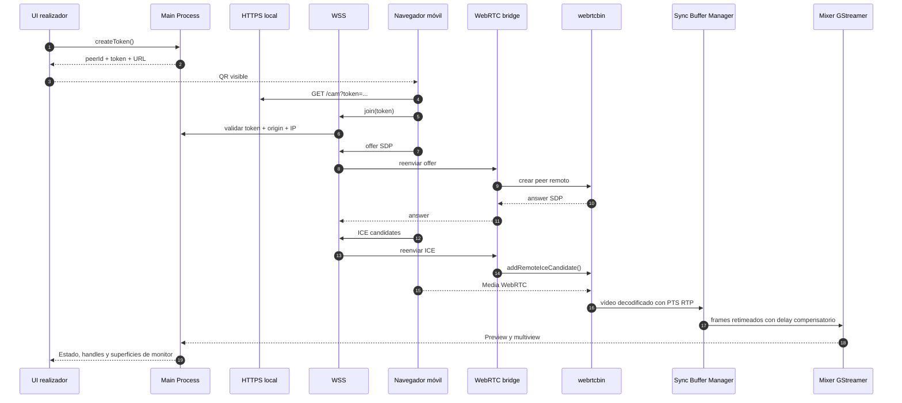

# Módulo 3. WebRTC y señalización local

## Para qué sirve este módulo

Este módulo explica cómo una cámara móvil llega al mixer sin instalar una app nativa adicional, usando QR, HTTPS, WebSocket y WebRTC.

Es el bloque que convierte el móvil en una fuente de vídeo integrada dentro de OpenMix-CG.

## Idea central

La conexión móvil no ocurre directamente entre la interfaz React y la cámara del teléfono. Hay varios pasos intermedios:

1. La UI genera un QR con una URL única.
2. El móvil abre una página servida por OpenMix-CG.
3. Esa página establece el canal de señalización por WebSocket.
4. Después negocia una sesión WebRTC.
5. El receptor GStreamer crea un `webrtcbin` por cámara.
6. La media decodificada entra en un slot dedicado del mixer.

## Flujo completo de conexión



## Piezas del módulo

### Cliente móvil

Es una página web ligera servida desde el propio Electron Main Process. Su papel es pedir permisos de cámara, crear la `RTCPeerConnection`, enviar estadísticas y mantener la pantalla activa mientras transmite.

### Servidor HTTPS

Sirve la página del cliente móvil bajo una URL local del tipo `https://IP:PUERTO/cam?token=...`. Es necesario porque los navegadores exigen contexto seguro para permitir `getUserMedia`.

### WebSocket de señalización

Gestiona el intercambio de mensajes que permiten preparar la sesión WebRTC. No transporta el vídeo; solo coordina la conexión.

### WebRTC bridge

Es el servicio que traduce entre el protocolo de señalización del proyecto y las llamadas reales al addon nativo. Mantiene separadas las responsabilidades de autenticar peers, negociar SDP/ICE y procesar media.

### webrtcbin

Es el elemento GStreamer que implementa la parte receptora WebRTC para cada cámara. En OpenMix-CG se crea uno por peer y se asocia a un slot visual del mixer.

## Conceptos principales

### WebSocket de señalización

Es el canal que intercambia `join`, `offer`, `answer`, `ice-candidate` y otros mensajes de control. Su papel es preparar la sesión WebRTC para que luego la media viaje por su propio camino.

### SDP

Es la descripción de la sesión multimedia. Define, entre otras cosas, los tipos de media y parámetros necesarios para que emisor y receptor se entiendan.

### ICE candidate

Es una dirección posible de conectividad para la sesión WebRTC. El intercambio de candidates permite encontrar el camino de red más viable entre móvil y receptor.

### STUN

Ayuda a descubrir direcciones de red utilizables durante la negociación ICE. En el modo local implementado actúa como apoyo, pero muchas veces la LAN ya permite candidates host suficientes.

### TURN

Es un relay para escenarios donde la conexión directa no es posible. Es importante en contribución remota, pero todavía no forma parte del MVP local implementado.

### Expiración de tokens

Hace que un QR deje de ser válido al cabo de unos minutos. Esto evita reutilizaciones accidentales, enlaces antiguos y sesiones huérfanas que ya no deberían aceptar conexiones.

### Validación de Origin

Comprueba que el WebSocket viene de la propia página móvil servida por OpenMix-CG. Sirve para que otra web no pueda reutilizar el token y secuestrar la sesión.

### Filtrado de red local

Limita las conexiones a loopback o direcciones privadas de LAN. Refuerza que el modo validado es **Local Studio** y no un servicio abierto a Internet.

### Certificado TLS autofirmado

Permite levantar HTTPS en red local sin depender de un dominio público. Es una solución práctica para el MVP, aunque obligue al usuario a aceptar una advertencia inicial del navegador.

### Código QR de conexión

Reduce fricción operativa. El realizador no necesita dictar una IP y un token; el operador de cámara solo escanea y entra.

### Wake Lock API

Impide que el móvil entre en reposo mientras transmite. Es un detalle pequeño, pero muy importante en uso real, porque una pantalla bloqueada puede cortar una contribución en medio del directo.

## Flujo de datos dentro del modo local

En el modo local ya implementado, el recorrido importante es este:

1. La UI pide un token al Main Process.
2. El Main construye una URL HTTPS con IP local y token.
3. El renderer convierte esa URL en un QR.
4. El móvil abre la página y se autentica con el token.
5. Se negocia la sesión WebRTC.
6. El bridge crea un peer nativo y le asigna un slot del mixer.
7. La rama decodificada pasa por el Sync Buffer Manager y después se enlaza a selectores del mixer: una ruta reducida para monitor y una ruta 1080p para REC.

La idea importante para la arquitectura es que cada cámara móvil no entra como una fuente indistinta, sino como una entrada reservada del mixer.

## Control de calidad monitor vs REC

El mismo móvil no debe comportarse igual cuando solo se está monitorizando que cuando se está grabando. La configuración móvil validada se inserta en el QR y se vuelve autoritaria desde el servidor al hacer `join`, para evitar que una pestaña antigua o un token reutilizado transmitan con parámetros obsoletos.

Además, el HTML del cliente móvil arranca con defaults defensivos ligeros (`quality=auto`, `bitrate=cap`, audio/preview local/cadencia/stats apagados). Estos defaults no sustituyen al QR ni al `welcome`: solo evitan que una URL incompleta, una recarga vieja o una divergencia temporal antes del `welcome` reactive el perfil histórico pesado.

El comportamiento por defecto validado es:

- `profile=fullhd`: se solicita 1920x1080 cuando el dispositivo lo permite, porque REC debe poder ser 1080p real y no un reescalado.
- `quality=auto`: arranca protegiendo la cadencia y puede mantener o recuperar 1080p cuando las estadísticas indican margen.
- `bitrate=cap`: evita hints agresivos de bitrate que en Android/Chrome provocaron entrega RTP a pulsos.
- `sender=managed`: OpenMix-CG controla el sender WebRTC en vez de dejarlo completamente al navegador.

Para diagnóstico fino existe `OPENMIX_MOBILE_MAX_BITRATE_KBPS`. Esta guarda no
cambia la resolución ni activa una ruta nueva: solo limita el techo de bitrate
que el cliente móvil aplica al `RTCRtpSender` cuando `bitrate=cap`. Sirve para
probar 1080p con techos intermedios, por ejemplo `8000` o `10000`, sin volver al
modo `bitrate=auto` del navegador ni al modo guiado con pistas SDP agresivas.

En grabación, el Main Process puede enviar por WebSocket un mensaje de control `video-quality` con modo `recording`.
Al recibirlo, el cliente móvil cambia a `fullhd`, solicita 1920x1080 exacto y prioriza mantener resolución para que REC pueda ser 1080p real.

Ese mensaje no transporta vídeo. Solo cambia parámetros del `RTCRtpSender` del navegador:

- En modo `monitor`, el sender puede usar escalado adaptativo para proteger la fluidez.
- En modo `auto`, el sender puede arrancar conservador y subir hacia 1080p cuando las estadísticas indican margen.
- En modo `recording`, el sender bloquea `scaleResolutionDownBy=1.0`, sube el bitrate objetivo y prioriza mantener resolución.

La captura del móvil puede estar en 1920x1080, pero lo que llega realmente al receptor lo indica la estadística `send=...`. Para que una grabación 1080p sea real, no basta con `capture=1920x1080`: durante REC también debe estabilizarse `send=1920x1080`.

## Sincronización multicámara

El Sync Buffer Manager se coloca después de recibir y decodificar WebRTC, pero antes de que la señal entre en las ramas de monitor y REC. Esa posición es importante:

- No rompe Preview/Program, porque el mixer sigue recibiendo una fuente normal.
- No duplica trabajo, porque monitor y REC heredan la misma decisión temporal.
- No mueve vídeo por IPC, porque todo ocurre dentro de GStreamer.
- No depende de la línea experimental de grafismo por textura compartida.

La implementación tiene dos capas. La primera normaliza el PTS de cada peer WebRTC al `running-time` del mixer padre y suaviza jitter con una cola posterior a decode. Esa normalización es clave cuando la segunda cámara entra tarde: su timeline RTP local no debe parecer "antiguo" frente al compositor que ya estaba funcionando. Además, si una cámara llega con discontinuidades grandes de PTS, el manager las cuenta como `corrected` y mantiene una cadencia continua. La segunda capa, una compuerta `identity sync=true`, queda apagada por defecto: en pruebas reales con dos cámaras redujo la salida a unos 3-4fps y llenó la cola, congelando multiview y Preview. Retiming solo se arma por defecto con al menos dos cámaras WebRTC que ya hayan entregado frames decodificados (`OPENMIX_SYNC_BUFFER_MIN_PEERS=2`), de modo que una única cámara o una segunda cámara a medio negociar mantienen bypass real: cola sin límite/leaky, clock apagado, `single-segment=false`, buffers sin modificar y sin log periódico del manager desde el hilo de streaming. `OPENMIX_SYNC_BUFFER_CLOCK=on` se conserva como guarda experimental para investigar backpressure, no como ruta operativa.

La capa de compensación NTP usa la información del `rtpjitterbuffer` interno de `webrtcbin`. Cuando llegan RTCP Sender Reports, GStreamer emite `handle-sync` con campos como `sr-ext-rtptime` y `sr-ntpnstime`; OpenMix-CG usa esa relación para asociar paquetes RTP con una referencia NTP. Si además GStreamer adjunta `GstReferenceTimestampMeta`, también se aprovecha. El registro del jitterbuffer es perezoso porque las caps de `media=video` pueden no estar listas durante `deep-element-added`; por eso se engancha el candidato y se decide si es vídeo cuando las caps aparecen. La lectura RTP/NTP se mantiene dormida con una sola cámara por defecto y se activa al llegar al umbral multicámara. Con esa referencia se estima la edad de captura de cada cámara y, si `OPENMIX_SYNC_BUFFER_NTP_APPLY=on`, se retrasa la que llegue antes mediante la cola decodificada, manteniendo `identity sync=true` apagado salvo diagnóstico.

La idea didáctica es:

```text
offsetCamara = tiempoNtpSenderReport - tiempoRtpSenderReport
offsetAB = offsetB - offsetA
```

Con ese offset, el receptor puede retrasar la cámara que llega antes para que el compositor compare frames que representan el mismo instante de captura. Esta capacidad existe conceptualmente en WebRTC/RTP; lo que OpenMix-CG aporta frente a soluciones como OBS + VDO.Ninja es que la sincronización se implementa dentro del receptor/mixer local, no como una combinación de URLs externas.

## Estado del módulo

### Ya resuelto

- Flujo QR -> página móvil -> join -> offer/answer -> media al mixer.
- Un `webrtcbin` por peer.
- Asígnación de slots dedicados en el mixer.
- Expiración de tokens.
- Validación de Origin.
- Filtrado de red local.
- Control `video-quality` para distinguir monitorización adaptativa y REC 1080p.
- Sync Buffer Manager posterior a decode y anterior al mixer.
- Captura de referencias RTP/NTP desde `rtpjitterbuffer`.
- Aplicación operativa de delay compensatorio NTP con techo `65ms`,
  `OPENMIX_SYNC_BUFFER_RETIMER=on` y `OPENMIX_SYNC_BUFFER_CLOCK=off`.
- Validación manual de dos cámaras móviles en el perfil local con
  Preview/Program nativos, multiview nativa reducida y 1080p cuando el emisor lo
  permite.

### Evolución pendiente

#### Robustez RTP/NTP fuera del perfil validado

El perfil validado funciona con dos cámaras locales y NTP aplicado. El siguiente
paso no es demostrar que el mecanismo exista, sino endurecerlo:
probar 2-3 móviles reales de modelos distintos, repetir en otra red/router,
medir cuánto margen existe antes de subir la latencia operacional y exponer el
perfil como ajuste persistente de la aplicación.

#### 1080p30 validado end-to-end multicámara

Se ha validado 1080p30 en el perfil local con dos cámaras sin grafismos ni REC
activos, y se ha documentado una intermitencia de Android/red/router/sesión
WebRTC que puede provocar pixelación o pulsos en movimiento. No debe venderse
como garantía absoluta para cualquier combinación de 2-3 cámaras, grafismos,
REC y redes distintas. No es solo una subida de resolución: exige revisar
encoder móvil, decodificación, carga del mixer, escalado y estabilidad
multicámara.

## Resumen corto que conviene recordar

> OpenMix-CG usa QR y HTTPS para abrir el cliente móvil, WebSocket para negociar la sesión y WebRTC para transportar la media; después GStreamer recibe cada cámara con un `webrtcbin` propio y la conecta a un slot dedicado del mixer.
