# Módulo 4. Terminología audiovisual y operativa

## Para qué sirve este módulo

Este documento traduce la jerga de realización audiovisual al funcionamiento concreto de OpenMix-CG.

Su objetivo no es solo definir palabras, sino ayudarte a explicar qué significan dentro del flujo real de operación del sistema.

## Flujo operativo básico

```mermaid
flowchart LR
    subgraph Inputs[Entradas]
        direction TB
        Source[Fuente disponible]
    end

    subgraph Control[Operacion]
        direction TB
        PVW[Preview]
        CUT[CUT]
        PGM[Program]
        PVW -->|preparacion| CUT
        CUT -->|conmutacion| PGM
    end

    subgraph Graphics[Superposicion]
        direction TB
        Overlay[Rotulos y grafismos]
    end

    subgraph Air[Salida]
        direction TB
        Output[Programa compuesto]
        Signal[Senal al aire]
        Output -->|salida final| Signal
    end

    Source -->|seleccion| PVW
    PGM -->|video base| Output
    Overlay -->|superposicion| Output


    classDef ui fill:#111827,stroke:#64748b,color:#ffffff,stroke-width:1.5px;
    classDef renderer fill:#111827,stroke:#64748b,color:#ffffff,stroke-width:1.5px;
    classDef input fill:#111827,stroke:#64748b,color:#ffffff,stroke-width:1.5px;
    classDef source fill:#111827,stroke:#64748b,color:#ffffff,stroke-width:1.5px;
    classDef bridge fill:#111827,stroke:#4f96a7,color:#ffffff,stroke-width:1.5px;
    classDef composition fill:#111827,stroke:#4f96a7,color:#ffffff,stroke-width:1.5px;
    classDef control fill:#111827,stroke:#4f96a7,color:#ffffff,stroke-width:1.5px;
    classDef main fill:#111827,stroke:#8b7a5d,color:#ffffff,stroke-width:1.5px;
    classDef output fill:#111827,stroke:#8b7a5d,color:#ffffff,stroke-width:1.5px;
    classDef media fill:#111827,stroke:#8d72aa,color:#ffffff,stroke-width:1.5px;
    classDef graphics fill:#111827,stroke:#8d72aa,color:#ffffff,stroke-width:1.5px;
    classDef monitoring fill:#111827,stroke:#8d72aa,color:#ffffff,stroke-width:1.5px;
    classDef native fill:#111827,stroke:#8d72aa,color:#ffffff,stroke-width:1.5px;
    classDef mobile fill:#111827,stroke:#4ca6b8,color:#ffffff,stroke-width:1.5px;
    class Source input;
    class PVW,CUT,PGM control;
    class Overlay graphics;
    class Output,Signal output;
```

## Conceptos principales

### Fuente

Es cualquier señal de entrada disponible para el realizador. En OpenMix-CG puede ser una fuente sintética de prueba o una cámara móvil recibida por WebRTC.

### Preview (PVW)

Es el monitor donde el realizador prepara la siguiente fuente antes de ponerla al aire. En OpenMix-CG existe simultaneamente a Program; internamente puede usar compositor, selector o ruta nativa según el modo de monitorización.

### Program (PGM)

Es la salida principal activa del sistema. Es lo que la audiencia veria, lo que se grabaria y lo que sirve como referencia de la señal final del directo.

### Al aire

Expresión operativa para decir que una señal ya está en Program y, por tanto, es la que realmente cuenta como salida activa. En OpenMix-CG equivale a decir que esa fuente es la seleccionada para la salida Program, aunque la implementación interna use compositor, selector o una combinación durante transiciones.

### Multiview

Es la vista que permite observar varias fuentes al mismo tiempo. Su función es operativa: dar al realizador una lectura rápida del estado de todas las entradas sin ir cambiando de pantalla.

### Miniatura

Es la representacion reducida de una fuente dentro del multiview. En OpenMix-CG se genera en el mixer para poder mostrar todas las fuentes con un coste más bajo.

### Cut

Es un corte directo, instantaneo, sin transición progresiva. En OpenMix-CG convive con `AUTO`: CUT intercambia inmediatamente Preview y Program; AUTO realiza una transición temporal configurable.

### Barras SMPTE

Es un patrón de prueba clásico de televisión. En OpenMix-CG se usa como fuente sintética y de depuración, pero también sirve para explicar que no todas las entradas tienen por qué ser una cámara real.

## Terminología de grafismo que ya conviene dominar

El motor de grafismo ya forma parte del MVP, así que estos términos son vocabulario operativo real de la aplicación, no solo preparación para una fase futura.

### Rótulo

Nombre generico de un elemento gráfico con texto superpuesto al vídeo. Puede identificar a una persona, mostrar información contextual o presentar un dato en pantalla.

### Faldón

Tipo de rótulo colocado normalmente en la parte inferior de la imagen. En realización se usa mucho para nombres, cargos y mensajes cortos.

### Lower third

Termino anglosajon equivalente, en muchos contextos, a un faldon de identificacion situado en el tercio inferior de la pantalla. OpenMix-CG lo usa como referencia de plantilla básica para el módulo de grafismo.

### Mosca

Grafico pequeño y persistente, normalmente situado en una esquina. Suele identificar el canal, el evento o la marca visual asociada a la emisión.

### Ticker

Franja de texto que suele desplazarse de forma continua. Se utiliza para titulares, resultados, noticias de última hora o información repetitiva que debe permanecer visible.

### Subir rótulo / bajar rótulo

Es la expresión operativa para mostrar o retirar un gráfico durante el directo. Habla más del gesto de realización que de la tecnología concreta usada para dibujarlo.

## Por qué esta terminología importa en OpenMix-CG

El proyecto no busca solo resolver un problema técnico, sino acercarse a un flujo real de realización audiovisual. Por eso esta jerga no es un adorno: define la manera en que el software será entendido y usado.

Saber explicar estos términos ayuda a:

- relaciónar la interfaz con operaciones reales de realización,
- justificar el paradigma Preview/Program,
- explicar por qué el grafismo se integra como una capa operativa y no solo decorativa,
- mostrar que OpenMix-CG está pensado para usuarios de producción ligera, no solo para programadores.

## Resumen corto que conviene recordar

> La terminología audiovisual convierte la arquitectura en lenguaje de operación: una fuente se prepara en Preview, entra a Program mediante CUT y, sobre esa señal al aire, se pueden superponer rótulos como faldones, moscas o tickers.
