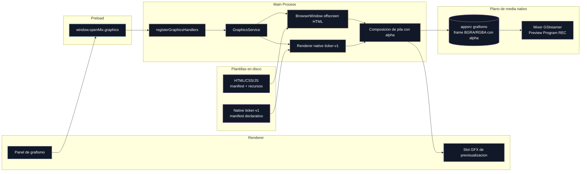

# Módulo 5. Grafismo y rótulos

## Para qué sirve este módulo

Este módulo explica como OpenMix-CG incorpora grafismo editable sin convertir la interfaz principal en un motor de animación improvisado.

La idea no es dibujar overlays a mano desde React, sino cargar plantillas preparadas por un diseñador y permitir que el realizador edite solo el contenido necesario desde la aplicación.

Este documento describe el motor de grafismo de la versión publicada: plantillas
HTML/native, edición de campos, slot GFX de previsualización e integración real
con el mixer mediante frames con alpha hacia GStreamer.

## Decisión de diseño

El módulo sigue una estrategia **preview-first**:

- **caso guía de referencia**: un `lower third` HTML/CSS/JS
- **motor base**: `BrowserWindow` oculta con render offscreen
- **plano de control**: IPC tipado entre Renderer, Preload y Main
- **objetivo operativo**: descubrir plantillas, cargarlas, editar campos y disparar `show`/`hide`

La composición real sobre el mixer forma parte de la versión implementada: el
motor renderiza grafismos con alpha y el pipeline nativo los mezcla sobre
Preview, Program y REC.

## Idea central

El grafismo en OpenMix-CG se apoya en una separación estricta entre **diseño** y **contenido**:

- el diseñador crea la plantilla
- el operador rellena campos
- el motor de grafismo renderiza el resultado
- el mixer recibe esa salida como una capa con alpha para Preview, Program o ambos

Esa separación es importante porque hace que el sistema sea mantenible y evita acoplar la UI principal a cada animación concreta.

## Flujo de control del motor de grafismo



## Capacidades del motor

El motor de grafismo incluye estas piezas:

- contratos IPC especificos del módulo `graphics`
- servicio `GraphicsService` en el Main Process
- handlers IPC dedicados
- API `window.openMix.graphics` en preload
- descubrimiento de plantillas en `resources/graphics-templates`
- carga de la plantilla activa en una `BrowserWindow` oculta
- actualización de campos editables
- acciones semánticas `show` y `hide`
- plantilla de referencia `lower-third-basic`

## Fuera del alcance implementado

El motor no intenta cubrir todos los formatos o flujos posibles. Quedan fuera de
la versión publicada:

- soporte real de Lottie o SVG más alla del contrato previsto
- galeria completa de plantillas en la UI React
- persistencia avanzada de presets del operador
- timeline, cola de gráficos o automatizaciones de realización

Esta acotación mantiene claro el contrato entre plantilla, servicio de grafismo,
UI y camino de media.

## Estado del camino de grafismo

El estado implementado del módulo es:

- Las plantillas HTML/CSS/JS se cargan en `BrowserWindow` offscreen controladas
  desde Main, no como componentes React ad hoc. En el modo estable, cada
  plantilla HTML se renderiza como una capa independiente y `GraphicsService`
  compone la pila por alpha antes de empujar el overlay a GStreamer.
- El panel de grafismo permite instanciar plantillas, editar campos, posicionarlas y elegir salida: Preview, Program o ambas.
- El slot GFX muestra el grafismo preparado aunque no este al aire, para que el operador no trabaje a ciegas.
- El Main Process empuja frames con alpha hacia GStreamer mediante `appsrc` de grafismo.
- El addon nativo compone esos frames sobre Preview/Program dentro del pipeline.
- Los monitores nativos necesitan `OPENMIX_GRAPHICS_OVERLAY_PUMP=active` para
  que el último raster de grafismo se escriba al `appsrc` de overlay. REC puede
  mezclar desde la misma caché de Program, pero eso no sustituye al pump live.
- Existe un modelo híbrido: HTML se mantiene para plantillas ricas o casi estáticas, y `format: native` queda disponible para overlays continuos como el ticker.
- La escena HTML agregada por iframes queda como optimización experimental bajo
  `OPENMIX_GRAPHICS_SCENE_RENDERER=on`: reducía ventanas offscreen, pero en
  prueba real no preservo bien la transparencia entre mosca y reloj simultaneos.
- La optimización profunda pendiente es reducir copias de la ruta HTML mediante
  una línea experimental de `useSharedTexture`/`IOSurface`; ver `ADR-0009`.

## Estructura de archivos adoptada

La base técnica sigue esta organización:

```text
resources/
  graphics-templates/
    lower-third-basic/
      manifest.json
      template.html
      styles.css
      script.js

src/
  shared/ipc/
    graphics-contracts.ts
  main/ipc/
    registerGraphicsHandlers.ts
  main/services/
    graphicsService.ts
  preload/
    index.ts
    index.d.ts
```

La idea de esta estructura es que el motor pueda crecer sin mezclar las plantillas con la interfaz React ni con la lógica del mixer.

## Contrato entre plantilla y software

La plantilla no se trata como un HTML cualquiera. Debe exponer un protocolo pequeño y predecible.

En la práctica, el motor espera estas capacidades:

- `getFields()` para describir los campos editables
- `updateField(fieldId, value)` para cambiar contenido
- `prepareIn()` para dejar el DOM transparente y listo antes de una entrada
- `preparePreview()` para mostrar el grafismo armado en el slot GFX sin ponerlo al aire
- `animateIn()` para entrada
- `animateOut()` para salida

Además, el `manifest.json` actúa como contrato estable para que el software descubra:

- identificador de la plantilla
- categoría
- formato
- resolución nominal
- archivo HTML de entrada
- lista de campos editables

## Por qué empezar por un lower third

El `lower third` es la mejor plantilla de arranque porque concentra casi todas las decisiones importantes del motor sin meter complejidad innecesaria:

- tiene campos editables claros
- necesita animación de entrada y salida
- exige respetar transparencia
- es un grafismo audiovisual muy reconocible
- sirve como caso claro para explicar diseño frente a contenido

Si este caso queda limpio, después será mucho más fácil extender el motor hacia moscas, marcadores, relojes o tickers.

## Por qué se separó primero el motor y después la composición

La composición final sobre GStreamer era el objetivo, pero adelantarla demasiado mezclaba dos problemas distintos:

1. que la plantilla se pueda cargar y controlar bien
2. que la salida RGBA llegue de forma eficiente al pipeline nativo

Separarlos en dos bloques permite depurar mejor y explicar mejor la arquitectura.

En otras palabras: primero se estabilizó el **motor de grafismo** y después se cerró su **camino de media**. Esta separación sigue siendo útil porque explica por qué los bugs de animación, alpha y rendimiento se pudieron depurar por capas.

## Resumen corto que conviene recordar

Si hubiera que resumir este módulo en una frase, una formulación útil sería esta:

> OpenMix-CG separa diseño y contenido: las plantillas HTML/native se controlan desde la UI, se renderizan desde Main y entran al mixer como overlays con alpha, manteniendo React fuera del plano de media.

## Nota operativa sobre animaciones offscreen

Las plantillas renderizadas con Chromium offscreen no deben asumir que los paints llegan siempre en el mismo orden que en un navegador visible. En las pruebas de mosca, ticker y reloj se detecto que un frame antiguo en estado final podía aparecer justo antes de la animación de entrada.

La solución adoptada queda documentada en [ADR-0006](../ADRs/ADR-0006-estados-de-grafismo-offscreen-y-slot-gfx.md): separar el estado al aire, el estado `pre-enter` y el estado de previsualización del slot GFX.

## Evolución híbrida documentada

La evolución híbrida del módulo queda descrita en [06-grafismo-nativo-y-modelo-híbrido.md](06-grafismo-nativo-y-modelo-hibrido.md).

Ese documento amplía el modelo con una propuesta concreta para mantener HTML
donde aporta flexibilidad y abrir un `format: native` para familias de overlays
continuos como el ticker.
