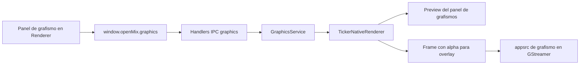

# Módulo 6. Grafismo nativo y modelo híbrido

## Para qué sirve este módulo

Este módulo describe la siguiente evolución del motor de grafismo de OpenMix-CG una vez comprobado que no todas las plantillas se comportan igual desde el punto de vista del rendimiento.

La idea no es abandonar el motor HTML, sino decidir con criterio que familias de overlays deben seguir en Chromium y cuales conviene sacar a un renderer nativo.

## Punto de partida real

El sistema actual ya combina dos capas distintas:

- generación visual del grafismo en `BrowserWindow` oculta si la plantilla es HTML
- composición del overlay del mixer en la ruta nativa de GStreamer

Eso significa que hoy el overlay del mixer ya es nativo en la composición, pero no necesariamente en la generación del grafismo.

En las mediciones del ticker se ha observado este patrón:

- animaciones cortas de entrada y salida: coste bajo y temporal
- overlays quietos una vez al aire: coste residual bajo
- ticker continuo: coste sostenido alto incluso sin el mixer iniciado

La instrumentacion del `paint` offscreen añade un dato clave:

- cobertura dirty media aproximada del ticker: 4.2%
- ratio de paints casi full-frame aproximado: 0.1%

Esto indica que Chromium no está repintando casi todo el frame en cada tick. El cuello principal parece estar en el coste fijo por paint, captura bitmap y procesado por frame.

## Decision de arquitectura propuesta

La propuesta para OpenMix-CG es un **modelo híbrido**.

Importante: esta evolución ya no es solo teórica. El runtime actual ya soporta una primera plantilla `format: native` con `rendererId: ticker-v1`, mientras que el resto del módulo sigue funcionando con el camino HTML/offscreen integrado como overlay real en GStreamer.

### HTML se mantiene para

- lower thirds
- moscas o bugs
- overlays casi estáticos
- plantillas con layout visual libre
- plantillas donde el valor principal sea la flexibilidad de diseño

### Native aparece para

- ticker continuo
- reloj en tiempo real
- crawl de creditos
- overlays con actualización sostenida o movimiento permanente

## Por qué no conviene hacerlo todo nativo

Hacer todo el módulo nativo parece limpio sobre el papel, pero técnicamente sería una sobrecorrección:

- reescribe una parte del sistema que ya funciona bien para muchos casos
- complica mucho la autoría visual
- obliga a sustituir un modelo fácil de explicar y mantener
- mezcla una optimización valida para plantillas continuas con una reingenieria total del grafismo

El modelo híbrido es más coherente con las mediciones reales del proyecto.

## Primera plantilla nativa implementada: ticker-native-v1

La primera plantilla nativa es la traduccion controlada del ticker básico actual a un renderer especializado.

### Objetivos funcionales

- mantener una banda inferior horizontal con alpha
- incluir una etiqueta fija a la izquierda
- desplazar el texto principal de forma continua en bucle
- permitir ajustar velocidad mediante duración del ciclo
- soportar animación de entrada y salida
- mantener el mismo flujo operativo desde la UI que una plantilla normal

### Objetivos técnicos

- no depender de DOM, CSS ni `BrowserWindow` offscreen
- generar frames BGRA o RGBA directamente en una ruta nativa controlada
- compartir renderer para preview y salida on-air
- poder limitar el redibujado a la franja realmente afectada

## Flujo implementado



## Carpeta propuesta para una plantilla native

La plantilla puede seguir viviendo como un recurso en disco. Lo que cambia no es la idea de plantilla, sino el motor que la interpreta.

Estructura propuesta:

```text
resources/
  graphics-templates/
    ticker-native-v1/
      manifest.json
      preview.svg
```

En esta familia ya no hay:

- `template.html`
- `styles.css`
- `script.js`

## Formato del manifiesto

La primera versión nativa usa un manifiesto declarativo. La plantilla sigue describiendose en disco, pero el renderer ya no ejecuta HTML.

Archivo de ejemplo: [06-ticker-native-v1-manifest.example.json](06-ticker-native-v1-manifest.example.json)

Plantilla real cargable por el runtime: [../../resources/graphics-templates/ticker-native-v1/manifest.json](../../resources/graphics-templates/ticker-native-v1/manifest.json)

Campos clave del manifiesto:

- `format: native`
- `rendererId: ticker-v1`
- `fields`: contenido editable por el operador
- `style`: tokens de estilo permitidos
- `layout`: geometría de la banda
- `animations`: entrada y salida semánticas

## Contrato de ticker-native-v1

### Campos editables por el operador

- `label`: texto corto de cabecera, por ejemplo `URGENTE`
- `text`: contenido del ticker
- `speed`: duración del ciclo en segundos

### Tokens de estilo controlados por la plantilla

- colores de fondo y texto
- ancho de la etiqueta
- alto de la barra
- padding horizontal
- tipografía y tamaño de fuente
- distancia entre repeticiones del texto

### Estado runtime usado por ticker-v1

El renderer recibe el mismo tipo de información semántica que hoy reciben las plantillas HTML:

- `isVisible`
- `previewActive`
- `outputActive`
- `animationFps`
- `placement`

Eso permite mantener un plano de control coherente aunque cambie el backend de render.

## Cómo se renderiza en esta primera versión

El renderer nativo no debe pensarse como un navegador reducido, sino como un generador especializado de una banda concreta.

La estrategia implementada en `ticker-native-v1` sigue esta idea:

1. resolver en Main la geometría real del ticker según preview, output y placement
2. rasterizar la banda con `@napi-rs/canvas` sin pasar por `BrowserWindow`
3. generar un frame BGRA con alpha que ya entra en el camino de composición existente
4. mover el desplazamiento horizontal con un reloj simple controlado por `animationFps`
5. reutilizar el mismo renderer tanto para la preview como para el overlay del mixer

## Que se gana con este diseño

- se elimina el coste fijo del `paint` offscreen de Chromium para el ticker
- la preview del panel y la salida on-air pueden nacer del mismo renderer
- la plantilla sigue siendo descubrible y explicable como recurso del sistema
- la UI del operador cambia poco o nada

## Que se pierde

- el ticker ya no se disena con HTML/CSS libre
- el estilo queda restringido a los tokens definidos por el renderer `ticker-v1`
- para variantes muy distintas habría que crear otra versión de renderer o ampliar el manifiesto

## Regla de evolución futura

Si una nueva familia de plantillas muestra el mismo patrón que el ticker, debe evaluarse con esta pregunta:

> ¿El problema principal viene del movimiento continuo y del coste fijo por frame, o de la complejidad del layout?

Si la respuesta es lo primero, esa familia es buena candidata para `format: native`.

Si la respuesta es lo segundo, probablemente conviene seguir en HTML.

## Resumen corto que conviene recordar

Si hubiera que resumir este módulo en una frase, una formulación útil sería esta:

> OpenMix-CG no necesita reescribir todo el grafismo de forma nativa; necesita un modelo híbrido donde las plantillas continuas, empezando por el ticker, usen un renderer especializado y las plantillas ricas o casi estáticas sigan en HTML.
