# Glosario modular de OpenMix-CG

Este documento pasa a ser el **índice central** del glosario y de la documentación explicativa por módulos.

La idea es separar dos niveles:

- **Índice rápido**: este archivo, para localizar conceptos por módulo sin perderse.
- **Documentos modulares**: explicaciones más detalladas sobre arquitectura, flujo de datos y papel de cada pieza dentro del sistema.

## Mapa general

```mermaid
flowchart LR
    subgraph UI[Operacion]
        direction TB
        React[Renderer React]
        Panels[Panel mixer, grafismo, audio, atajos]
        React --> Panels
    end

    subgraph Bridge[Puente seguro]
        direction TB
        Preload[Preload API]
        IPC[IPC tipado]
        Preload --> IPC
    end

    subgraph MainArea[Proceso principal]
        direction TB
        MainProc[Electron Main]
        Services[Servicios Main\nMixer, Sources, Graphics, Output, Shortcuts]
        HTTPS[HTTPS local]
        WSS[WSS de senalizacion]
        MainProc --> Services
        Services --> HTTPS
        Services --> WSS
    end

    subgraph Media[Plano de media nativo]
        direction TB
        NativeAddon[Addon N-API GStreamer]
        Ingest[webrtcbin y videos locales]
        Sync[Sync Buffer RTP/NTP]
        GraphicsOverlay[Overlay grafismo alpha]
        Mixer[Mixer GStreamer]
        MediaOutputs[Monitores nativos, multiview y REC]
        NativeAddon --> Ingest
        Ingest --> Sync
        Sync --> Mixer
        GraphicsOverlay --> Mixer
        Mixer --> MediaOutputs
    end

    subgraph Mobile[Cliente movil]
        direction TB
        QR[QR de conexion]
        Browser[Navegador movil]
        QR -->|abre enlace| Browser
    end

    React -->|comandos| Preload
    IPC -->|handlers| MainProc
    Services --> NativeAddon
    Services --> GraphicsOverlay
    Browser -->|carga /cam| HTTPS
    Browser -->|media WebRTC| Ingest
    WSS -->|join, offer e ICE| Services
    MediaOutputs -->|handles, geometria y estado| MainProc
    MainProc -->|estado y control| React


    classDef ui fill:#111827,stroke:#64748b,color:#f8fafc,stroke-width:1.5px;
    classDef renderer fill:#111827,stroke:#64748b,color:#f8fafc,stroke-width:1.5px;
    classDef input fill:#111827,stroke:#64748b,color:#f8fafc,stroke-width:1.5px;
    classDef source fill:#111827,stroke:#64748b,color:#f8fafc,stroke-width:1.5px;
    classDef bridge fill:#111827,stroke:#4f96a7,color:#f8fafc,stroke-width:1.5px;
    classDef composition fill:#111827,stroke:#4f96a7,color:#f8fafc,stroke-width:1.5px;
    classDef control fill:#111827,stroke:#4f96a7,color:#f8fafc,stroke-width:1.5px;
    classDef main fill:#111827,stroke:#8b7a5d,color:#f8fafc,stroke-width:1.5px;
    classDef output fill:#111827,stroke:#8b7a5d,color:#f8fafc,stroke-width:1.5px;
    classDef media fill:#111827,stroke:#8d72aa,color:#f8fafc,stroke-width:1.5px;
    classDef graphics fill:#111827,stroke:#8d72aa,color:#f8fafc,stroke-width:1.5px;
    classDef monitoring fill:#111827,stroke:#8d72aa,color:#f8fafc,stroke-width:1.5px;
    classDef native fill:#111827,stroke:#8d72aa,color:#f8fafc,stroke-width:1.5px;
    classDef mobile fill:#111827,stroke:#4ca6b8,color:#f8fafc,stroke-width:1.5px;
    class React,Panels ui;
    class Preload,IPC bridge;
    class MainProc,Services,HTTPS,WSS main;
    class NativeAddon,Ingest,Sync,GraphicsOverlay,Mixer,MediaOutputs media;
    class QR,Browser mobile;
```

## Documentos por módulo

### Visión general del sistema

Documento recomendado para entender cómo encajan todos los bloques antes de entrar en cada tecnología.

- Archivo: [Arquitectura/00-vision-general-y-flujo-de-datos.md](Arquitectura/00-vision-general-y-flujo-de-datos.md)
- Contiene: arquitectura global, bloques principales y recorrido extremo a extremo de los datos.

### Módulo 1. Electron e IPC

Documento recomendado para entender cómo se reparten responsabilidades entre UI, preload y proceso principal.

- Archivo: [Arquitectura/01-electron-e-ipc.md](Arquitectura/01-electron-e-ipc.md)
- Conceptos cubiertos:
  - Main Process
  - Renderer Process
  - Preload
  - contextBridge
  - IPC tipado
  - `IpcResult<T>`
  - Plano de control frente a plano de media
  - Atajos de teclado configurables
  - Panel de audio diagnóstico
  - Calibración por palmada/claqueta
  - Referencia visual nativa de Audio

### Módulo 2. GStreamer y mixer

Documento recomendado para entender el addon nativo, el pipeline del mixer y cómo se construyen Program, Preview y miniaturas.

- Archivo: [Arquitectura/02-gstreamer-y-mixer.md](Arquitectura/02-gstreamer-y-mixer.md)
- Conceptos cubiertos:
  - Addon nativo
  - N-API
  - ThreadSafeFunction
  - Pipeline de GStreamer
    - Bus de GStreamer
    - GstClock
    - appsink
    - appsrc
    - `clocksync`
    - backpressure en colas de ficheros locales
    - retimer PTS de vídeo local a `running-time`
    - pausa de vídeo local por bloqueo de pad
    - cue de primer frame `OPENMIX_LOCAL_VIDEO_CUE_PAUSE_MS`
    - ruta A/B secundaria para vídeo local en Program
    - loop de vídeo local
    - política Auto Program para vídeo local
    - contención de `FLUSH_START/FLUSH_STOP` en vídeo local
    - entrada negra live de reposo por slot
    - precalentamiento `OPENMIX_LOCAL_VIDEO_PREWARM`
    - Sync Buffer Manager
    - guarda `OPENMIX_SYNC_BUFFER_MIN_PEERS`
    - normalización PTS a `running-time`
    - `identity single-segment`
    - `videorate` de REC a 30fps
    - retimer raw de REC antes del encoder
    - frame gate realtime de REC
    - retimer secuencial de REC
    - `GstBufferList` en REC
    - fondo negro de `comp_pgm_record`
    - REC como consumidor de Program
    - overlay final de grafismo en REC
    - selector WebRTC de monitor
    - selector WebRTC de REC
    - vídeo local como fuente del mixer
    - registro de ocupación de slots
    - superficie nativa de multiview
    - `GstVideoOverlay`
    - buffer visual diagnóstico de Audio
  - Encoder H.264 de grabación
  - VideoToolbox
  - x264enc
  - Compositor
  - Pad de solicitud
  - Alpha
  - valve
  - Z-order
  - Preroll
  - Fuente
  - Miniatura
  - Barras SMPTE

### Módulo 3. WebRTC, señalización y conectividad local

Documento recomendado para entender el flujo QR -> móvil -> WebSocket -> WebRTC -> mixer.

- Archivo: [Arquitectura/03-webrtc-y-señalización-local.md](Arquitectura/03-webrtc-y-senalizacion-local.md)
- Conceptos cubiertos:
  - webrtcbin
  - WebSocket de señalización
  - SDP
  - ICE candidate
  - STUN
  - TURN
  - Expiración de tokens
  - Validación de Origin
  - Filtrado de red local
  - Certificado TLS autofirmado
  - Código QR de conexión
    - Wake Lock API
    - RTP timestamp
    - RTCP Sender Report
    - 1080p30

### Módulo 4. Terminología audiovisual y operativa

Documento recomendado para traducir la jerga de realización al funcionamiento concreto de OpenMix-CG.

- Archivo: [Arquitectura/04-terminologia-audiovisual-y-operativa.md](Arquitectura/04-terminologia-audiovisual-y-operativa.md)
- Conceptos cubiertos:
  - Preview (PVW)
  - Program (PGM)
  - Al aire
  - Multiview
  - Cut
  - Mosca
  - Faldón
  - Rótulo
  - Subir rótulo / bajar rótulo
  - Ticker
  - Lower third

### Módulo 5. Grafismo y rótulos

Documento recomendado para entender cómo se cargan plantillas de grafismo, cómo se editan sus campos y por qué la Fase 4 arranca con un motor preview-first antes de integrarse con el mixer.

- Archivo: [Arquitectura/05-grafismo-y-rótulos.md](Arquitectura/05-grafismo-y-rotulos.md)
- Conceptos cubiertos:
  - Separación diseño/contenido
  - Plantilla HTML/CSS/JS
  - `manifest.json`
  - BrowserWindow oculta
  - Offscreen rendering
  - Escena HTML agregada
  - Overlay con alpha hacia GStreamer
  - `window.openMix.graphics`
  - Lower third
  - `animateIn()` / `animateOut()`
  - Preview-first

### Módulo 6. Grafismo nativo y modelo híbrido

Documento recomendado para entender por qué OpenMix-CG no necesita mover todo el grafismo a render nativo, sino abrir una segunda familia de plantillas para overlays continuos como el ticker, ya materializada en una primera implementación `ticker-v1`.

- Archivo: [Arquitectura/06-grafismo-nativo-y-modelo-híbrido.md](Arquitectura/06-grafismo-nativo-y-modelo-hibrido.md)
- Conceptos cubiertos:
  - Modelo híbrido
  - `format: native`
  - `rendererId`
  - Ticker nativo
  - Dirty coverage
  - Paint offscreen
  - Renderizador especializado
  - Manifiesto declarativo

### Investigación de grafismo por textura compartida

Documento recomendado para entender por qué el spike de optimización profunda se separa del roadmap principal.

- Archivo: [ADRs/ADR-0009-ramas-para-roadmap-y-shared-texture.md](ADRs/ADR-0009-ramas-para-roadmap-y-shared-texture.md)
- Conceptos cubiertos:
  - `useSharedTexture`
  - `IOSurface`
  - CEF / `cefsrc`
  - GstWPE / `wpesrc`
  - fallback RGBA/appsrc
  - spike aislado frente a roadmap principal

## Como mantener este glosario a partir de ahora

Cuando aparezca un concepto nuevo, conviene decidir primero a qué módulo pertenece:

1. Si explica arquitectura Electron, preload o contratos entre procesos, va a Electron e IPC.
2. Si explica pipelines, mezcla, salida de frames o diagnóstico nativo, va a GStreamer y mixer.
3. Si explica conexión móvil, negociación WebRTC, red local o seguridad de acceso, va a WebRTC y señalización.
4. Si es jerga de realización o de grafismo operativo, va a terminología audiovisual.

Después, si el término cambia la forma de entender el sistema, se actualiza este índice para que siga sirviendo como puerta de entrada.

## Alcance actual

Estos documentos cubren lo ya construido en Fase 0, Fase 1, Fase 2 y Fase 3, el arranque arquitectónico de Fase 4 para el motor de grafismo, la integración real de overlays con el mixer, la primera implementación del camino de plantillas nativas especializadas, las transiciones básicas del mixer y el cierre funcional del MVP de Fase 5 en el módulo de output.

En el estado actual, Fase 5 puede darse por cerrada a nivel MVP: grabación local del Program con grafismo superpuesto, ajustes persistentes de grabación, ruta dedicada de mayor resolución para REC y chequeo de espacio libre antes de iniciar. La reestructuración posterior de Fase 1 mueve la escritura de REC al plano de media nativo: Electron conserva el control de inicio/parada y estado, pero ya no recibe los frames BGRA 1080p para grabar. El chequeo se hace sobre la carpeta real de destino, así que una ruta montada en disco externo funciona como destino válido mientras el volumen siga presente. Si esa carpeta desaparece, el sistema falla con un mensaje claro en lugar de recrearla silenciosamente en otra unidad.

En el estado actual del producto, Sync Buffer RTP/NTP, vídeos locales, atajos configurables, multiview reducida y REC nativo con audio local quedan cerrados a nivel MVP. La pestaña de audio local diagnóstico permite onda, pico, delay sugerido y referencia visual nativa; ese delay puede aplicarse a la primera rama de audio local de REC nativo bajo guarda. Queda como mejora futura extender el modelo a mezcla live de Program/streaming si el producto lo necesita. La investigación de shared texture se mantiene como línea experimental independiente.

Tras la fase de pulido, el producto se nombra de forma unificada como
**OpenMix-CG** en `package.json`, Electron Builder, la ventana principal y los
assets de marca versionados. Además, la refactorizacion interna reciente separa
el addon nativo y varios servicios por dominio sin cambiar la frontera
arquitectónica: Electron/React siguen enviando control, y GStreamer sigue
conservando el plano de media.
