# Glosario modular de OpenMix-CG

Este documento pasa a ser el **índice central** del glosario y de la documentación explicativa por módulos.

La idea es separar dos niveles:

- **Índice rápido**: este archivo, para localizar conceptos por módulo sin perderse.
- **Documentos modulares**: explicaciones más detalladas sobre arquitectura, flujo de datos y papel de cada pieza dentro del sistema.

## Mapa general

```mermaid
flowchart LR
    subgraph UI[Operacion]
        direction TB
        React[Renderer React]
        Panels[Panel mixer, grafismo, audio, atajos]
        React --> Panels
    end

    subgraph Bridge[Puente seguro]
        direction TB
        Preload[Preload API]
        IPC[IPC tipado]
        Preload --> IPC
    end

    subgraph MainArea[Proceso principal]
        direction TB
        MainProc[Electron Main]
        Services[Servicios Main\nMixer, Sources, Graphics, Output, Shortcuts]
        HTTPS[HTTPS local]
        WSS[WSS de senalizacion]
        MainProc --> Services
        Services --> HTTPS
        Services --> WSS
    end

    subgraph Media[Plano de media nativo]
        direction TB
        NativeAddon[Addon N-API GStreamer]
        Ingest[webrtcbin y videos locales]
        Sync[Sync Buffer RTP/NTP]
        GraphicsOverlay[Overlay grafismo alpha]
        Mixer[Mixer GStreamer]
        MediaOutputs[Monitores nativos, multiview y REC]
        NativeAddon --> Ingest
        Ingest --> Sync
        Sync --> Mixer
        GraphicsOverlay --> Mixer
        Mixer --> MediaOutputs
    end

    subgraph Mobile[Cliente movil]
        direction TB
        QR[QR de conexion]
        Browser[Navegador movil]
        QR -->|abre enlace| Browser
    end

    React -->|comandos| Preload
    IPC -->|handlers| MainProc
    Services --> NativeAddon
    Services --> GraphicsOverlay
    Browser -->|carga /cam| HTTPS
    Browser -->|media WebRTC| Ingest
    WSS -->|join, offer e ICE| Services
    MediaOutputs -->|handles, geometria y estado| MainProc
    MainProc -->|estado y control| React


    classDef ui fill:#111827,stroke:#64748b,color:#f8fafc,stroke-width:1.5px;
    classDef renderer fill:#111827,stroke:#64748b,color:#f8fafc,stroke-width:1.5px;
    classDef input fill:#111827,stroke:#64748b,color:#f8fafc,stroke-width:1.5px;
    classDef source fill:#111827,stroke:#64748b,color:#f8fafc,stroke-width:1.5px;
    classDef bridge fill:#111827,stroke:#4f96a7,color:#f8fafc,stroke-width:1.5px;
    classDef composition fill:#111827,stroke:#4f96a7,color:#f8fafc,stroke-width:1.5px;
    classDef control fill:#111827,stroke:#4f96a7,color:#f8fafc,stroke-width:1.5px;
    classDef main fill:#111827,stroke:#8b7a5d,color:#f8fafc,stroke-width:1.5px;
    classDef output fill:#111827,stroke:#8b7a5d,color:#f8fafc,stroke-width:1.5px;
    classDef media fill:#111827,stroke:#8d72aa,color:#f8fafc,stroke-width:1.5px;
    classDef graphics fill:#111827,stroke:#8d72aa,color:#f8fafc,stroke-width:1.5px;
    classDef monitoring fill:#111827,stroke:#8d72aa,color:#f8fafc,stroke-width:1.5px;
    classDef native fill:#111827,stroke:#8d72aa,color:#f8fafc,stroke-width:1.5px;
    classDef mobile fill:#111827,stroke:#4ca6b8,color:#f8fafc,stroke-width:1.5px;
    class React,Panels ui;
    class Preload,IPC bridge;
    class MainProc,Services,HTTPS,WSS main;
    class NativeAddon,Ingest,Sync,GraphicsOverlay,Mixer,MediaOutputs media;
    class QR,Browser mobile;
```

## Documentos por módulo

### Visión general del sistema

Documento recomendado para entender cómo encajan todos los bloques antes de entrar en cada tecnología.

- Archivo: [Arquitectura/00-vision-general-y-flujo-de-datos.md](Arquitectura/00-vision-general-y-flujo-de-datos.md)
- Contiene: arquitectura global, bloques principales y recorrido extremo a extremo de los datos.

### Módulo 1. Electron e IPC

Documento recomendado para entender cómo se reparten responsabilidades entre UI, preload y proceso principal.

- Archivo: [Arquitectura/01-electron-e-ipc.md](Arquitectura/01-electron-e-ipc.md)
- Conceptos cubiertos:
  - Main Process
  - Renderer Process
  - Preload
  - contextBridge
  - IPC tipado
  - `IpcResult<T>`
  - Plano de control frente a plano de media
  - Atajos de teclado configurables
  - Panel de audio diagnóstico
  - Calibración por palmada/claqueta
  - Referencia visual nativa de Audio

### Módulo 2. GStreamer y mixer

Documento recomendado para entender el addon nativo, el pipeline del mixer y cómo se construyen Program, Preview, multiview y REC.

- Archivo: [Arquitectura/02-gstreamer-y-mixer.md](Arquitectura/02-gstreamer-y-mixer.md)
- Nota técnica complementaria: [Notas/gstreamer-detalles-operativos.md](Notas/gstreamer-detalles-operativos.md)
- Conceptos cubiertos:
  - Addon nativo
  - N-API
  - Pipeline de GStreamer
  - Plano de media frente a plano de control
  - Program, Preview, CUT y AUTO
  - Selectores, compositores, `valve`, `appsrc` y `appsink`
  - Monitores nativos y multiview reducida
  - Fuentes WebRTC y vídeos locales
  - Sync Buffer Manager con RTP/NTP
  - REC nativo 1080p con audio local opcional
  - Rutas de diagnóstico y compatibilidad
  - Encoder H.264 de grabación
  - VideoToolbox
  - x264enc

### Módulo 3. WebRTC, señalización y conectividad local

Documento recomendado para entender el flujo QR -> móvil -> WebSocket -> WebRTC -> mixer.

- Archivo: [Arquitectura/03-webrtc-y-señalización-local.md](Arquitectura/03-webrtc-y-senalizacion-local.md)
- Conceptos cubiertos:
  - webrtcbin
  - WebSocket de señalización
  - SDP
  - ICE candidate
  - STUN
  - TURN
  - Expiración de tokens
  - Validación de Origin
  - Filtrado de red local
  - Certificado TLS autofirmado
  - Código QR de conexión
    - Wake Lock API
    - RTP timestamp
    - RTCP Sender Report
    - 1080p30

### Módulo 4. Terminología audiovisual y operativa

Documento recomendado para traducir la jerga de realización al funcionamiento concreto de OpenMix-CG.

- Archivo: [Arquitectura/04-terminologia-audiovisual-y-operativa.md](Arquitectura/04-terminologia-audiovisual-y-operativa.md)
- Conceptos cubiertos:
  - Preview (PVW)
  - Program (PGM)
  - Al aire
  - Multiview
  - Cut
  - Mosca
  - Faldón
  - Rótulo
  - Subir rótulo / bajar rótulo
  - Ticker
  - Lower third

### Módulo 5. Grafismo y rótulos

Documento recomendado para entender cómo se cargan plantillas de grafismo, cómo se editan sus campos y cómo se integran con el mixer.

- Archivo: [Arquitectura/05-grafismo-y-rótulos.md](Arquitectura/05-grafismo-y-rotulos.md)
- Conceptos cubiertos:
  - Separación diseño/contenido
  - Plantilla HTML/CSS/JS
  - `manifest.json`
  - BrowserWindow oculta
  - Offscreen rendering
  - Escena HTML agregada
  - Overlay con alpha hacia GStreamer
  - `window.openMix.graphics`
  - Lower third
  - `animateIn()` / `animateOut()`
  - Preview-first

### Módulo 6. Grafismo nativo y modelo híbrido

Documento recomendado para entender por qué OpenMix-CG no necesita mover todo el grafismo a render nativo, sino abrir una segunda familia de plantillas para overlays continuos como el ticker, ya materializada en una primera implementación `ticker-v1`.

- Archivo: [Arquitectura/06-grafismo-nativo-y-modelo-híbrido.md](Arquitectura/06-grafismo-nativo-y-modelo-hibrido.md)
- Conceptos cubiertos:
  - Modelo híbrido
  - `format: native`
  - `rendererId`
  - Ticker nativo
  - Dirty coverage
  - Paint offscreen
  - Renderizador especializado
  - Manifiesto declarativo

### Grafismo por textura compartida

Concepto útil para entender una posible optimización futura del transporte de
overlays HTML.

- Conceptos cubiertos:
  - `useSharedTexture`
  - `IOSurface`
  - CEF / `cefsrc`
  - GstWPE / `wpesrc`
  - fallback RGBA/appsrc
  - línea experimental aislada frente al producto validado

## Criterio de mantenimiento del glosario

Cuando se documente un concepto nuevo, conviene decidir primero a qué módulo pertenece:

1. Si explica arquitectura Electron, preload o contratos entre procesos, va a Electron e IPC.
2. Si explica pipelines, mezcla, salida de frames o diagnóstico nativo, va a GStreamer y mixer.
3. Si explica conexión móvil, negociación WebRTC, red local o seguridad de acceso, va a WebRTC y señalización.
4. Si es jerga de realización o de grafismo operativo, va a terminología audiovisual.

Después, si el término cambia la forma de entender el sistema, se actualiza este índice para que siga sirviendo como puerta de entrada.

## Alcance de la documentación

Esta documentación pública cubre el MVP funcional de OpenMix-CG: mixer
Preview/Program, conexión de cámaras móviles por WebRTC, monitores nativos,
multiview reducida, grafismo HTML/native, vídeos locales como fuentes,
grabación nativa del Program y primera integración de audio local para REC.

El alcance técnico se centra en explicar cómo se separan el plano de control
Electron/React y el plano de media GStreamer/WebRTC, cómo se organizan los
módulos principales y qué límites operativos tiene la versión publicada. La
documentación complementa el código fuente y el manual de usuario; no sustituye
a la memoria académica del proyecto.

Las líneas de evolución documentadas son: empaquetado autocontenido, validación
en Windows y Linux, mezcla de audio multifuente, contribución remota con TURN y
optimización experimental de grafismo mediante texturas compartidas.

El producto se nombra de forma unificada como **OpenMix-CG** en `package.json`,
Electron Builder, la ventana principal y los assets de marca versionados. El
addon nativo y los servicios principales están organizados por dominios sin
cambiar la frontera arquitectónica: Electron/React envían control, y GStreamer
conserva el plano de media.
