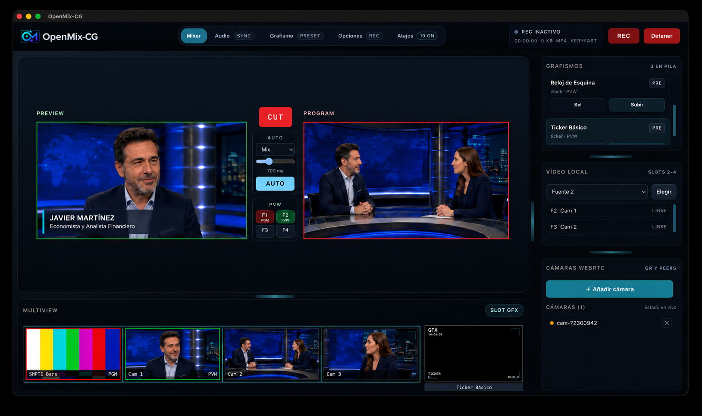
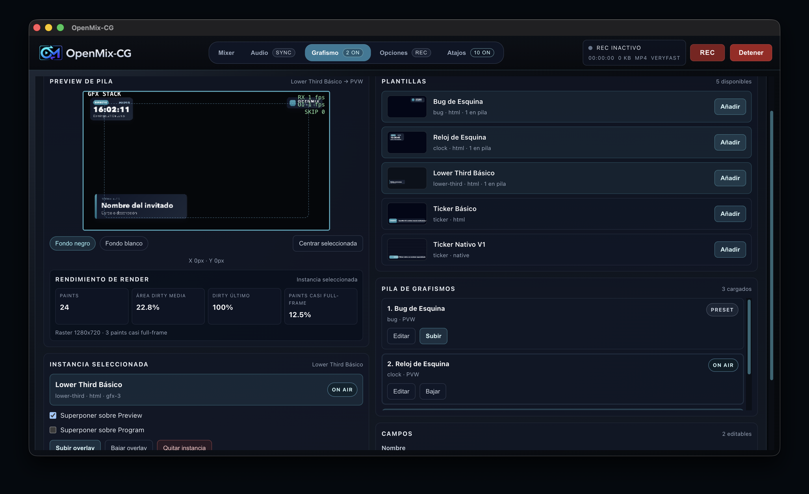
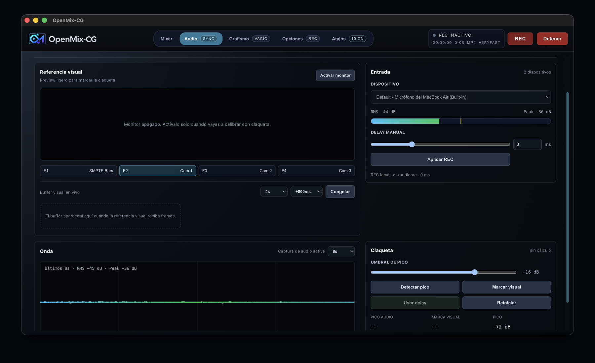
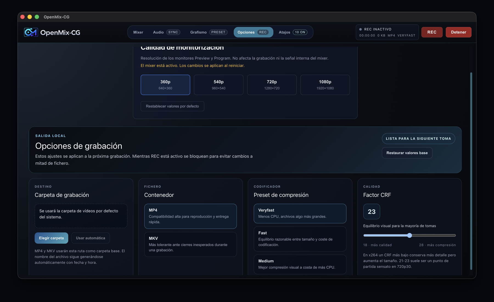
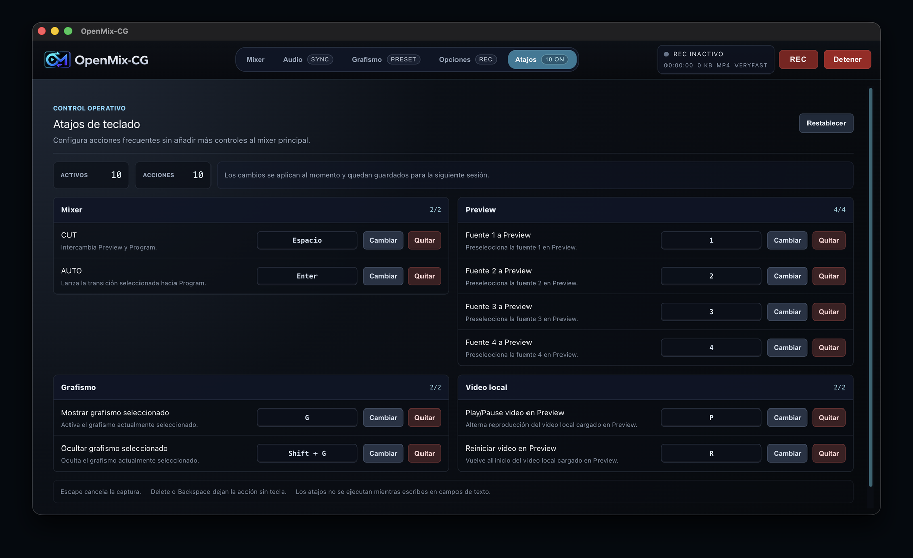
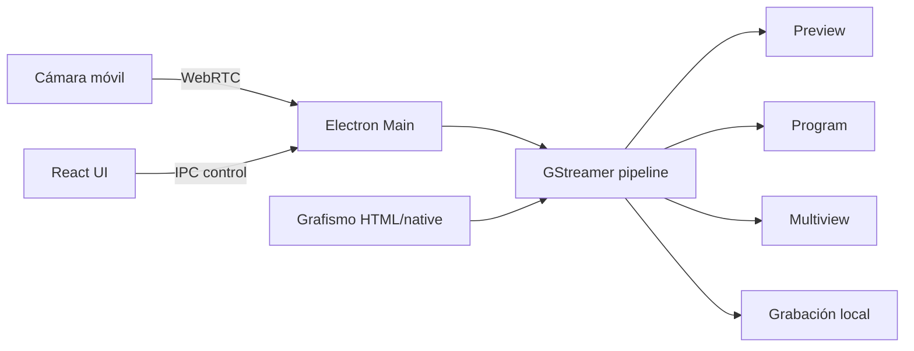

# OpenMix-CG

<p align="center">
  <picture>
    <source media="(prefers-color-scheme: dark)" srcset="resources/brand/final/openmix-cg-logo-horizontal-ui-dark-transparent.png">
    <source media="(prefers-color-scheme: light)" srcset="resources/brand/final/openmix-cg-logo-horizontal-docs-transparent.png">
    
  </picture>
</p>

<p align="center">
  Plataforma de realización multicámara en tiempo real con Electron, React, GStreamer y WebRTC.
</p>

<p align="center">
  <a href="LICENSE"></a>
  
  
</p>

OpenMix-CG es una aplicación de escritorio para realizar producciones de vídeo ligeras con varias fuentes, grafismos y grabación local. Reproduce el flujo habitual de realización en directo con **Preview**, **Program**, **CUT**, **AUTO**, multiview y control de grafismos, orientado a estudiantes, podcasts, eventos locales y pequeñas productoras.

<p align="center">
  
</p>

<p align="center"><em>Captura ilustrativa: las imágenes de los monitores se han sustituido por una escena ficticia para mostrar el uso de la interfaz.</em></p>

## Características

- Mixer **Preview/Program** con CUT, AUTO y selección rápida de fuentes.
- Cámaras móviles en red local mediante QR, HTTPS, WebSocket y WebRTC.
- Monitores Preview y Program con ruta nativa basada en GStreamer.
- Multiview reducida con HUD, slots activos y slot de grafismo.
- Grafismo HTML y ruta nativa especializada para overlays continuos.
- Composición de grafismos sobre Preview, Program y grabación.
- Vídeos locales cargados desde disco como fuentes pinchables.
- Grabación local de Program con vídeo 1080p y audio local opcional.
- Panel de audio con medidor, onda, referencia visual y cálculo asistido de delay por palmada o claqueta.
- Panel de atajos configurables para acciones frecuentes.

## Capturas

| Mixer | Grafismo |
|---|---|
|  |  |

| Audio | Opciones |
|---|---|
|  |  |

| Atajos |
|---|
|  |

## Arquitectura resumida

OpenMix-CG separa el plano de control y el plano de media:

- **Electron Main Process** coordina GStreamer, señalización WebRTC, ficheros, grabación y ventanas internas de grafismo.
- **React Renderer** muestra la interfaz de operación y envía órdenes de control.
- **Preload** expone una API segura entre Renderer y Main.
- **GStreamer** mantiene las rutas pesadas de vídeo y audio fuera de Electron IPC.
- **WebRTC** permite conectar móviles como cámaras sin instalar una app nativa en el teléfono.



## Requisitos

La ruta validada actualmente es macOS con Apple Silicon y GStreamer instalado en el sistema.

- Node.js y pnpm.
- Xcode Command Line Tools, necesarias para compilar el addon nativo.
- GStreamer con plugins de WebRTC, GL, VideoToolbox y audio local.

En macOS, una instalación típica de GStreamer con Homebrew es:

```bash
brew install gstreamer gst-plugins-base gst-plugins-good gst-plugins-bad gst-plugins-ugly gst-libav
```

## Ejecución en desarrollo

```bash
pnpm install
pnpm run build:native
pnpm dev
```

La aplicación abre una ventana de escritorio. Desde el panel de cámaras se genera un QR para conectar móviles en la misma red local.

## Empaquetado macOS

Para generar una aplicación `.app` de prueba:

```bash
pnpm run package:mac:dir
```

Para generar un `.dmg` de prueba:

```bash
pnpm run package:mac:dmg
```

La fase de empaquetado actual usa GStreamer como dependencia externa: el equipo donde se ejecute la app debe tener una instalación compatible de GStreamer.

## Documentación

- [Guía de instalación](Documentacion/Instalacion.md)
- [Manual de usuario](Documentacion/Manual-usuario.md)
- [Estado del proyecto](Documentacion/Estado-del-proyecto.md)
- [Índice de documentación técnica](Documentacion/README.md)
- [Arquitectura general y flujo de datos](Documentacion/Arquitectura/00-vision-general-y-flujo-de-datos.md)
- [GStreamer y mixer](Documentacion/Arquitectura/02-gstreamer-y-mixer.md)
- [WebRTC y señalización local](Documentacion/Arquitectura/03-webrtc-y-senalizacion-local.md)
- [Grafismo y rótulos](Documentacion/Arquitectura/05-grafismo-y-rotulos.md)

## Estado del proyecto

El proyecto está en estado de MVP funcional para producción local en red propia. Están validados el mixer, la conexión de cámaras móviles, grafismos, vídeos locales, multiview, grabación local y una primera integración de audio local para REC.

Quedan como líneas de evolución principales:

- empaquetar GStreamer dentro de la distribución o en un instalador propio;
- validar rutas completas para Windows y Linux;
- ampliar el panel de audio hacia mezcla multifuente;
- añadir más plantillas de grafismo listas para usar;
- estudiar contribución remota con TURN.

## Licencia

Este proyecto se publica bajo licencia [MIT](LICENSE).
